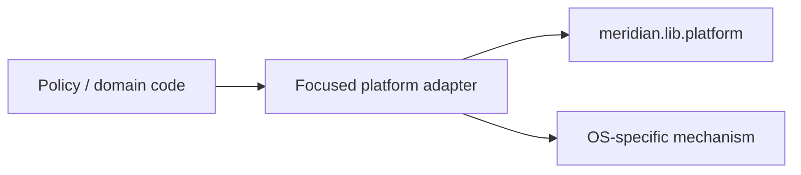

# Target Architecture — Architecture Refactor Roadmap

## Decision summary

The correct framing for Windows/cross-platform support is a **platform adapter / boundary** model.

Not:

- one big Windows service
- scattered `IS_WINDOWS` branches in policy/domain code
- a repo-wide portability layer that every module must understand

## Target shape

Policy and domain layers stay OS-neutral.
Platform differences live at the seam where the mechanism actually changes.

## Architecture principles for this roadmap

1. **Shared primitives stay shared**
   - `meridian.lib.platform` remains the common foundation for OS detection and low-level helpers.

2. **Adapters are capability-specific**
   - If launch semantics differ, contain that in the launch boundary.
   - If transport differs, contain that in the streaming/control boundary.
   - If state-root resolution differs, contain that in the path/root boundary.

3. **Branches belong at the edge**
   - Repeated platform checks in policy/domain code are a design smell.
   - They should trigger adapter extraction, not more inline branching.

4. **Stage gates must be explicit**
   - Any stage that touches paths, process launch, env vars, shell invocation, signals, locking, sockets/control transport, root/config discovery, or filesystem state must verify Windows/plain-directory semantics or state the accepted limit.

## Current examples to build from

The repo already suggests the right seam placement:

- `src/meridian/lib/platform/` — shared primitives
- `src/meridian/lib/state/user_paths.py` — user-root resolution
- launch process selector / `WindowsConsoleLauncher` — launch boundary
- streaming control transport — TCP-vs-Unix socket split

The roadmap should extend those boundaries, not replace them with a monolith.

## Non-goals

- No giant `WindowsService`
- No policy-layer OS branching
- No separate "Windows port" stage detached from the rest of the architecture work
