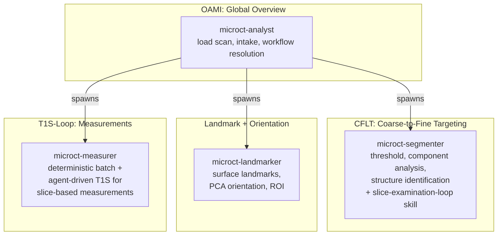
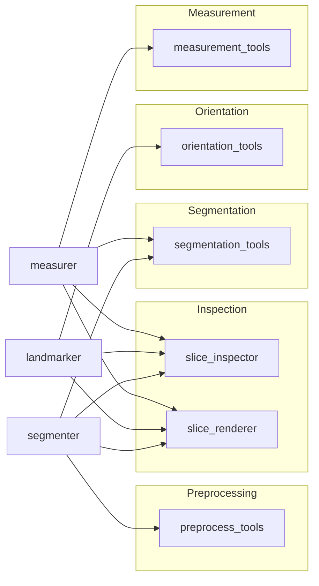

# Agent Architecture: Progressive Narrowing for Micro-CT Analysis

Related documents:
- [Architecture](architecture.md)
- [Behavioral spec](../spec/behavioral-spec.md)
- [Architecture overview](overview.md)

## 3DMedAgent pattern adaptation

The 3DMedAgent framework (Wang et al. 2026) defines three stages of
progressive narrowing for 3D medical image analysis:

1. **OAMI** (Organ-Aware Memory Initialization) — global volume overview
   with organ-level priors
2. **CFLT** (Coarse-to-Fine Lesion Targeting) — narrow from volume to
   candidate regions/slices
3. **T1S-Loop** (Think-with-1-Slice) — iterative single-slice examination
   with visual reasoning

The micro-CT toolkit maps these stages to a multi-agent pipeline with two
instances of the T1S-Loop: one for seed placement (implemented as the
`slice-examination-loop` skill, loaded by the segmenter) and one for
measurements (existing, in the measurer).

## Agent pipeline



## Slice-examination-loop skill: the missing T1S-Loop

### Problem

The current segmenter places seeds by calculating coordinates from
volume geometry (centroid + offsets). When bones bridge (common in OA
scans), this fails because:

1. `seed_from_region` flood-fills seeds to entire connected components
2. When two seeds share a component, the last seed overwrites the first
3. Watershed receives a single-label marker and produces trivial output

The smoke-tester (p4188) confirmed this: on a bridged synthetic volume,
the current approach produces output with only ONE nonzero label — the
second seed completely overwrites the first.

### Solution: visual examination before seed placement

The `slice-examination-loop` skill implements the render→examine→reason→act→render
loop. When the segmenter detects a bridged-bone case, it loads the skill
and runs the loop within its own kernel context — no spawn required,
volume stays in memory.

```
Receive: bone_mask (1 component), intensity volume, spacing,
         expected structure names, preprocessing provenance

Preprocess if needed:
  median_filter_volume (gated by compute-efficiency)

Loop:
  ┌─────────────────────────────────────┐
  │  render_slice(vol, plane, index)    │
  │  ↓                                  │
  │  examine rendered image             │
  │  identify bone centers on slice     │
  │  ↓                                  │
  │  create_point_markers(...)          │
  │  watershed_from_markers(...)        │
  │  ↓                                  │
  │  render_slice(vol, plane, index,    │
  │               mask=labeled)         │ ← opens next cycle
  └─────────────────────────────────────┘
         │                    │
    acceptable            futile
         │                    │
  accept with          report attempts,
  evidence             failure modes,
                       recommendation
```

The result render is the examination render for the next cycle. There is
no distinct verify step — examining the result IS the verification, and
that examination opens the next iteration or closes the loop.

### Why a skill, not a separate agent

Spawning a dedicated agent for the examination loop would require
serializing the intensity volume and bone mask across kernel boundaries —
large array transfers for what is effectively a local iterative loop.
The segmenter already has the volume in context. Running the loop via a
skill keeps everything in the same kernel, eliminates spawn overhead, and
lets the segmenter continue directly with the labeled result.

The loop is a behavior pattern that multiple agents use: the measurer
already does a version of it for measurement slice selection. The skill
formalizes the pattern so the segmenter can load it explicitly, and other
agents (atlas registration, ROI picking) can load it without reimplementing it.

### Interaction with the segmenter

The segmenter decides when to invoke the skill:

```python
# After threshold and component analysis
stats = component_summary(bone_mask, spacing)
expected_bones = len(workflow["expected_structures"])  # e.g., 4 for mouse knee

if stats["total_components"] < expected_bones:
    # Fewer components than expected → bones are bridged
    # Load slice-examination-loop skill, run in-context with:
    #   - volume: kernel variable (no copy)
    #   - bone_mask: current mask
    #   - spacing: voxel spacing tuple
    #   - expected_structures: bone names from workflow
    #   - preprocessing_provenance: filter applied?, params
    #   - coordinate_frame: "original" or "oriented" + transform
    # Receive: labeled volume, seed evidence artifact
```

The trigger is a mismatch between expected structure count (from the
workflow) and actual connected components. This avoids running the
examination loop on correct multi-component cases. The segmenter uses
the labeled output for structure identification exactly as it does when
watershed produces labels from the flood-fill path — the downstream path
is unchanged.

## Generic agent design

### Agents are workflow-agnostic

All agents (analyst, segmenter, landmarker, measurer) are designed to
work with ANY micro-CT workflow, not just mouse knee OA. Domain-specific
behavior comes from the workflow definition file, not from agent prompt
hardcoding.

| Agent | Generic capability | Workflow-specific input |
| --- | --- | --- |
| analyst | orchestration, stage gating | workflow file: stage_order, acceptance_checks |
| segmenter | threshold, component analysis, structure ID, visual seed placement | workflow: thresholds, bone names, expected structure count |
| landmarker | surface landmarks, orientation, ROI | workflow: landmark definitions, orientation protocol |
| measurer | deterministic + T1S measurements | workflow: measurement definitions, acceptance values |

### Skill composition

```
microct-analyst:
  - compute-efficiency
  - session-management
  - pyvista-interactive
  - mct-visual-review

microct-segmenter:
  - compute-efficiency
  - session-management
  - mct-visual-review
  - slice-examination-loop     ← NEW: loaded when bridging detected

microct-landmarker:
  - session-management
  - pyvista-interactive
  - mct-visual-review

microct-measurer:
  - compute-efficiency
  - session-management
  - pyvista-interactive
  - mct-visual-review
  - slice-examination-loop     ← available for multi-plane measurement work
```

## Tool→agent mapping



The segmenter gains `preprocess_tools` access to run `median_filter_volume`
within the `slice-examination-loop` skill.

## Evidence flow

Each stage produces structured evidence that flows downstream:

```
intake → volume_metadata.json
  ↓
segmenter → structure_assignments.json, labels.nii.gz
            seed_evidence.json (when bridging detected)
  ↓
landmarker → landmark_positions.json, orientation_frame.json, roi_masks/
  ↓
measurer → measurement_results.json, qc_overlays/
  ↓
cleanup → clean_notebook.ipynb
```

`seed_evidence.json` is produced by the segmenter when it runs the
`slice-examination-loop` skill. It records the visual examination decisions
that led to seed placement — the reasoning that was previously implicit
(or absent) in the pipeline.
