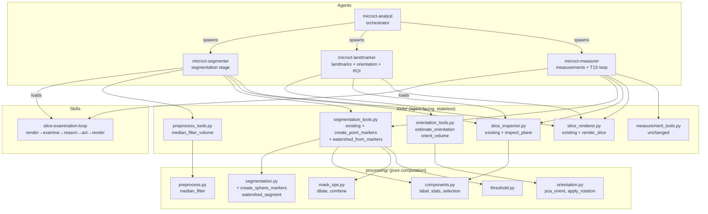
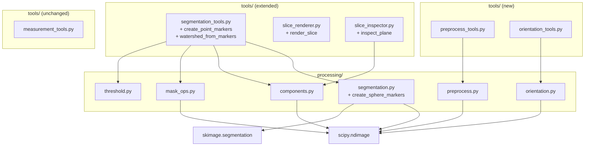

# Architecture: Generic Micro-CT Analysis Toolkit

## Structural decision

Extend the existing toolkit with three new tool modules and one new skill,
keeping deterministic computation in tool boundaries and anatomical judgment
in the agent layer. The existing recipe executor (`run_mask_recipe`) is NOT
extended with preprocessing or orientation ops because those produce volumes
(not masks) and operate on different lifecycles.

Related documents:
- [Behavioral spec](../spec/behavioral-spec.md)
- [Agent architecture](agent-architecture.md)
- [Architecture overview](overview.md)
- [Seed curation decision](seed-curation-decision.md) (preserved architect-spawn draft)
- [Seed curation target architecture](seed-curation-target-architecture.md) (superseded architect-spawn draft)
- [Refactors](../refactors.md)
- [Feasibility](../feasibility.md)

## Package boundary diagram



## New module: `tools/preprocess_tools.py`

### Purpose

Expose volume-level preprocessing operations that exist in `processing/`
but are currently only accessible through stage drivers. The Amira SOP
applies median filter BEFORE threshold — the composable primitives in
`segmentation_tools.py` skip this step because `median_filter` was never
exposed as a tool.

### Public surface

```python
def median_filter_volume(
    volume: np.ndarray,
    *,
    iterations: int = 3,
    size: int = 3,
) -> dict[str, Any]:
    """Apply iterative XY-plane median filter.

    Returns {"volume": filtered, "parameters": {...}, "summary": {...}}
    """
```

### Design rationale

- Separate from `segmentation_tools.py` because preprocessing produces
  transformed volumes, not masks. The recipe executor carries masks
  forward between steps; it cannot carry volumes (confirmed by probe p4188).
- The smoke-tester confirmed (p4188 Probe 4) that adding preprocessing
  to `run_mask_recipe` would require architectural changes to the recipe
  model. The simpler path: agents call `median_filter_volume` as a
  standalone step before entering segmentation recipes.
- Memory budget: median_filter on float32 needs ~12N bytes minimum
  (HIGH RISK in compute-efficiency). The tool must be gated.

### Dependencies

```
tools/preprocess_tools.py → processing/preprocess.py → scipy.ndimage
```

No other dependencies at the tools layer.

## New module: `tools/orientation_tools.py`

### Purpose

Expose orientation primitives for agents that need to align volumes
before measurement or inspection. Currently `pca_orient()` is only
accessible through the landmarks/orientation stage driver.

### Public surface

```python
def estimate_orientation(
    label_mask: np.ndarray,
    spacing: tuple[float, float, float],
    *,
    method: str = "pca",
) -> dict[str, Any]:
    """Compute principal axes and rotation matrix.

    Returns {"rotation": R, "translation": t, "principal_axes": axes,
             "parameters": {...}, "summary": {...}}
    """

def orient_volume(
    volume: np.ndarray,
    rotation: np.ndarray,
    spacing: tuple[float, float, float],
    *,
    order: int = 0,
) -> dict[str, Any]:
    """Apply rigid rotation preserving shape and spacing.

    Returns {"volume": rotated, "parameters": {...}, "summary": {...}}
    """
```

### Design rationale

- Separate from segmentation because orientation changes the coordinate
  frame for ALL downstream operations, not just mask repair.
- Wraps existing `processing/orientation.py` functions.
- Returns transform metadata so agents can map coordinates between frames.

### Dependencies

```
tools/orientation_tools.py → processing/orientation.py → scipy.ndimage
```

## Extensions to `tools/segmentation_tools.py`

### New functions

```python
def create_point_markers(
    volume_shape: tuple[int, ...],
    points: list[tuple[int, int, int]],
    labels: list[str],
    *,
    radius_voxels: int = 2,
    radius_mm: float | None = None,
    spacing: tuple[float, float, float] | None = None,
) -> dict[str, Any]:
    """Create sphere markers at specified points.

    Unlike create_seeds() which flood-fills connected components,
    this creates small spheres that do not leak across bridges.

    Returns {"markers": int32_array, "parameters": {...}, "summary": {...}}
    """

def watershed_from_markers(
    volume: np.ndarray,
    markers: np.ndarray,
    *,
    mask: np.ndarray | None = None,
    spacing: tuple[float, float, float] | None = None,
    compactness: float = 0,
) -> dict[str, Any]:
    """Run watershed using pre-built markers.

    Returns {"labeled": int32_array, "parameters": {...}, "summary": {...}}
    """
```

### Why not modify `create_seeds` / `seeded_watershed`

The existing functions delegate to `seed_from_region()` which has
documented flood-fill semantics. Changing that behavior would break:
- Tests that assert component-fill behavior
- Stage driver logic in `stages/segmentation.py`
- Seed curation domain model in `domain/seed_curation.py`

Instead: add new functions with point-marker semantics alongside the
existing ones. The segmenter (via the `slice-examination-loop` skill)
uses `create_point_markers` + `watershed_from_markers`. The stage driver
continues using the flood-fill path for cases where bones separate into
distinct components. Over time, the flood-fill path may be deprecated as
the point-marker path proves reliable.

### Processing layer support

New function in `processing/segmentation.py`:

```python
def create_sphere_markers(
    volume_shape: tuple[int, ...],
    points: list[tuple[int, ...]],
    *,
    radius_voxels: int = 2,
) -> np.ndarray:
    """Create int32 marker array with labeled spheres.

    Each point gets a sphere of the specified radius, filled with
    label = 1-based index. Overlapping spheres raise ValueError.
    """
```

This is a pure numpy operation — no scipy needed for sphere generation.

## Extensions to `tools/slice_renderer.py`

### New function

```python
def render_slice(
    volume: np.ndarray,
    index: int,
    *,
    plane: str = "axial",
    mask: np.ndarray | None = None,
    points: list[tuple[int, int, int]] | None = None,
    title: str | None = None,
    output_path: str | None = None,
    spacing: tuple[float, float, float] | None = None,
) -> dict[str, Any]:
    """Render orthogonal slice (axial/sagittal/coronal) as PNG.

    Returns {"path": str, "parameters": {...}, "summary": {...}}
    """
```

### Plane indexing

| Plane | Array indexing | Display axes |
| --- | --- | --- |
| axial | `volume[z, :, :]` | x horizontal, y vertical |
| sagittal | `volume[:, y, :]` | x horizontal, z vertical |
| coronal | `volume[:, :, x]` | y horizontal, z vertical |

### 3D point projection

When `points` is provided as 3D (z, y, x) coordinates:
1. Filter to points within ±0.5 voxels of the slice plane
2. Project to 2D display coordinates for the selected plane
3. Render as scatter overlay

This enables agents to overlay seed positions on any slice view.

## Extensions to `tools/slice_inspector.py`

### New function

```python
def inspect_plane(
    mask: np.ndarray,
    index: int,
    *,
    plane: str = "axial",
    spacing: tuple[float, float, float] = (1.0, 1.0, 1.0),
) -> dict[str, Any]:
    """Inspect orthogonal slice with the same output shape as inspect_slice."""
```

Same return contract as `inspect_slice` but for arbitrary planes.

## New skill: `slice-examination-loop`

### Role

A reusable skill implementing the render→examine→reason→act→render loop
for spatial decisions that require visual anatomy judgment. Any agent
facing a decision that depends on what a slice looks like — seed
placement, measurement slice selection, ROI boundary picking, atlas
registration — loads this skill rather than inventing its own loop
structure.

The segmenter loads the skill when it encounters a bridged-bone case.
The measurer already uses a version of this pattern for measurement slice
selection. The skill formalizes the pattern and enforces evidence
discipline.

### Why a skill, not a separate agent

A dedicated agent for the examination loop would require spawning, which
means the intensity volume and bone mask would need to be passed between
kernel contexts. Keeping the loop in the same agent context:
- Avoids serializing large numpy arrays across kernel boundaries
- Eliminates spawn overhead for what is effectively a local loop
- Lets the segmenter continue with the labeled output immediately

The loop is a behavior pattern, not a role. Skills are the right
mechanism for injecting behavior patterns.

### Loop structure

```
Receive: bone_mask with 1 component (bridged)
         intensity volume reference
         spacing
         expected structure names
         preprocessing provenance

Preprocess if needed:
  median_filter_volume (gated by compute-efficiency)

Loop:
  render_slice(volume, plane, index)
    → examine rendered image
    → identify bone centers or adjust seed positions
    → create_point_markers(shape, points, labels, radius_voxels=2)
    → watershed_from_markers(filtered, markers, mask=bone_mask)
    → render_slice(volume, plane, index, mask=labeled)  ← opens next cycle

Terminate when:
  - Result acceptable: accept with seed evidence artifact
  - Futile: report attempts, failure modes, and recommendation
```

### Evidence contract

Every accepted seed placement produces a JSON artifact:

```json
{
  "plane_examined": "sagittal",
  "slice_indices_examined": [181, 190, 175],
  "coordinate_frame": "original",
  "orientation_transform": null,
  "points_zyx": {
    "femur": [210, 181, 244],
    "tibia": [350, 181, 267],
    "fibula": [370, 181, 290]
  },
  "radius_voxels": 2,
  "resolved_radii_zyx": [2, 2, 2],
  "preprocessing_applied": true,
  "filter_params": {"iterations": 3, "size": 3},
  "watershed_params": {"compactness": 0, "masked": true},
  "iteration_count": 2,
  "selection_reasoning": "Sagittal mid-plane shows clear joint space...",
  "confidence": "high"
}
```

When orientation is applied before seed placement, the evidence records:
```json
{
  "coordinate_frame": "oriented",
  "orientation_transform": {
    "rotation": [[...], [...], [...]],
    "center_physical": [z, y, x]
  }
}
```

## Interaction with existing agents

### segmenter changes

The segmenter prompt gains a new decision point after component analysis.
When bones are bridged, the segmenter runs the `slice-examination-loop`
skill directly in its own context — no spawn:

```python
# After threshold and component analysis
stats = component_summary(bone_mask, spacing)
expected_bones = len(workflow["expected_structures"])  # e.g., 4 for mouse knee

if stats["total_components"] < expected_bones:
    # Fewer components than expected → bones are bridged
    # Load slice-examination-loop skill and run in-context:
    #   - volume: intensity volume (in-kernel reference)
    #   - bone_mask: current mask
    #   - spacing: voxel spacing tuple
    #   - expected_structures: list of bone names from workflow
    #   - preprocessing_provenance: whether median filter already applied, params
    #   - coordinate_frame: "original" or "oriented" + transform if applied
    # Receive: labeled volume, seed evidence artifact
```

The trigger is a mismatch between expected structure count (from the
workflow) and actual connected components — not a raw dominance share.
This avoids running the examination loop on correct multi-component cases.

The segmenter then uses the labeled output for structure identification,
exactly as it does now when watershed produces labels from flood-fill
seeds — the downstream path is unchanged.

### measurer — no changes needed

The measurer's T1S-Loop for measurements is independent of seed placement.
It continues using `scan_region` → `inspect_slice` → `render_axial` for
measurement slice selection. The new `render_slice` and `inspect_plane`
are available, and the measurer may load `slice-examination-loop` for
future multi-plane measurement work, but this is not required for the
current workflow.

### landmarker — gains orientation tools

The landmarker can use `estimate_orientation` and `orient_volume` from
the tools layer instead of going through the stage driver. This is
optional — the stage driver path continues to work.

## Module dependency diagram



## What does NOT change

- `measurement_tools.py` signatures
- `slice_inspector.py` existing function signatures
- `slice_renderer.py` existing function signatures (`render_axial`,
  `render_extent_profile`, `render_mask_3d`)
- `segmentation_tools.py` existing function signatures and behavior
  (`threshold_mask`, `component_summary`, `select_component`,
  `dilate_mask`, `combine_masks`, `create_seeds`, `seeded_watershed`,
  `run_mask_recipe`)
- Stage drivers (`stages/segmentation.py`, `stages/measurement.py`,
  `stages/landmarks_orientation.py`)
- The existing 185+ tests
- Analyst, landmarker, measurer, cleanup, workflow-creator agent prompts
  (minor additions only, no breaking changes)

## Error model

New errors follow the existing pattern — agent-readable strings:

| Error | Message |
| --- | --- |
| Overlapping markers | `markers for 'femur' and 'tibia' overlap at 33 voxels; separate seed points by at least {2*radius+1} voxels` |
| Out-of-bounds seed | `point (500, 181, 244) is outside volume shape (400, 512, 512)` |
| Unsupported plane | `plane must be 'axial', 'sagittal', or 'coronal'; got 'oblique'` |
| Negative iterations | `iterations must be non-negative, got -1` |
| Single-label watershed | warning: `markers contain only one nonzero label; watershed will produce trivial result` |

## Memory considerations

| Operation | Peak estimate | Risk |
| --- | --- | --- |
| `median_filter_volume` (float32) | ~12N bytes | HIGH |
| `create_point_markers` | ~4N bytes (int32) | LOW |
| `watershed_from_markers` | ~N*(V+4+1+4) bytes | HIGH |
| `orient_volume` | ~2*N*V bytes | MEDIUM |
| `render_slice` | single 2D slice | NEGLIGIBLE |

The segmenter must run the compute-efficiency resource gate before
`median_filter_volume` and `watershed_from_markers` when using the
`slice-examination-loop` skill.
