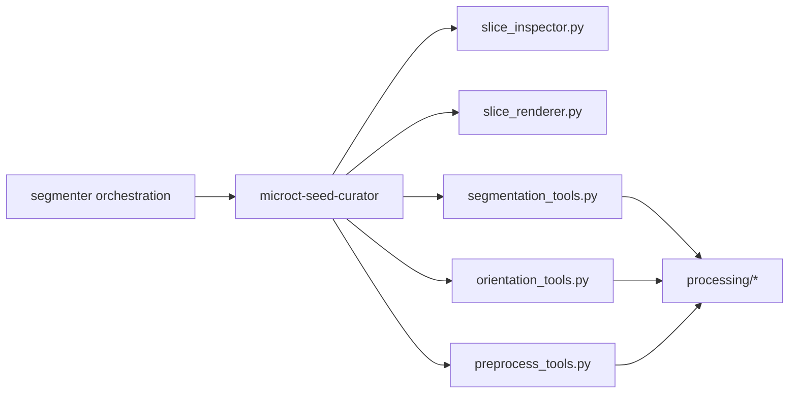

# Decision: dedicate seed curation to a substage agent, keep deterministic mechanics in focused tool boundaries

> [!NOTE]
> **Historical decision record.** The decision to use a dedicated seed-curator substage remains accepted, but implementation details are now consolidated in [Architecture](architecture.md) and [Behavioral spec](../spec/behavioral-spec.md).

## Status

Accepted as rationale; superseded as an implementation source of truth by [Architecture](architecture.md).

Related documents:
- [Architecture options](seed-curation-options.md)
- [Target architecture](seed-curation-target-architecture.md)
- [Design overview](../overview.md)
- [Authoritative architecture](architecture.md)

## Decision

Adopt **Option D** as the workflow boundary and pair it with a **boundary-
corrected tool layout inspired by Option B**.

The target state is:
- a dedicated `microct-seed-curator` agent or substage for the T1S-style
  seed-placement and watershed loop
- new `tools/preprocess_tools.py` for volume filtering such as `median_filter`
- new `tools/orientation_tools.py` for orientation and coordinate-frame helpers
- extended `tools/segmentation_tools.py` for point-marker creation and watershed
  execution
- existing `tools/slice_inspector.py` and `tools/slice_renderer.py` retained as
  separate modules, with plane-aware additions rather than a merged
  `slice_tools.py`

## Why this is the right boundary

The irreversible design risk here is putting anatomical judgment in the wrong
place.

- **Tools** are best at deterministic transforms: build marker arrays, run
  watershed, compute summaries, render views, apply orientation matrices.
- **Agents** are best at iterative anatomical judgment: which slice to inspect,
  whether markers are too close, whether the split is plausible, whether to
  reseed.

If the seed loop stays inside a general segmenter prompt, the workflow remains
implicit and brittle. If it moves into tool or recipe contracts, those contracts
become overloaded with judgment responsibilities they should not own.

## Rejected alternatives

### Rejected: Option A as the full architecture

Why rejected:
- solves helper exposure, not workflow ownership
- makes `segmentation_tools.py` absorb unrelated concerns
- leaves the crucial seed-review loop buried in a generic prompt

### Rejected: Option B as written

Why rejected:
- correct instinct on preprocess/orientation separation
- wrong boundary on `slice_tools.py`; pure inspection and rendering side effects
  should stay separate

### Rejected: Option C as the primary contract

Why rejected:
- orientation changes the coordinate frame for later tools and evidence
- preprocessing operates on full volumes with a different lifetime from mask
  repair
- turning all of that into recipe steps would overgrow the recipe model

## Consequences

Positive:
- keeps deterministic numerical logic in stable tool seams
- gives the seed loop an explicit owner that downstream prompts can implement
- preserves mask-recipe architecture for threshold/mask repair without forcing
  orientation into it
- limits migration churn for existing slice and measurement workflows

Costs:
- adds one more agent/substage to the orchestration graph
- requires a small new evidence model for seed placements and watershed runs
- requires plane-aware slice helpers and coordinate-transform discipline

## Implementation stance

Build the target state additively:
1. add focused tool boundaries first
2. extend segmentation primitives for point-marker watershed
3. add plane-aware inspection/rendering helpers without breaking axial wrappers
4. introduce the `microct-seed-curator` substage on top of those tools
5. add smoke scenarios that prove the new loop can reseed bridged anatomy
