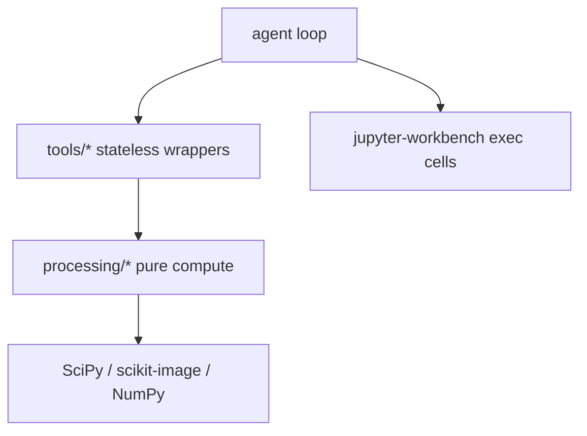
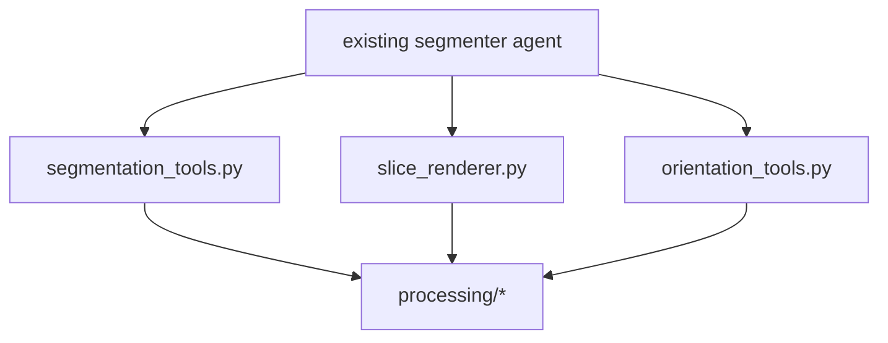
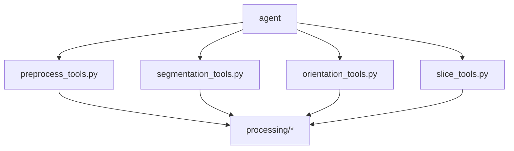
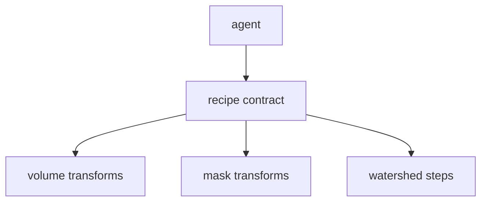
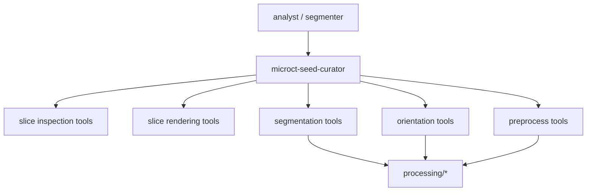

# Structural options: seed curation and watershed control

> [!NOTE]
> **Historical draft.** This options analysis is preserved for rationale. The authoritative implementation design is [Architecture](architecture.md), with requirements in [Behavioral spec](../spec/behavioral-spec.md).

## Problem frame

The prior segmentation-control design solved threshold repair for mask-oriented
workflows. This extension adds a different class of problem:
- seed placement is sparse-coordinate driven, not threshold driven
- watershed quality depends on marker separation, not just mask cleanup
- multi-plane anatomical review is needed before and after watershed
- orientation can change which slice views are clinically meaningful

That means the new architecture must support both:
1. deterministic image-processing operations
2. a tight agent judgment loop over slices and seed locations

## Existing boundary baseline

Stable facts inherited from the reference design:
- `tools/` is the agent-facing boundary
- `processing/` owns numerical mechanics
- workbench exec cells are the audit boundary
- large arrays should stay in kernel memory

## External facts that affect the choice

- `skimage.segmentation.watershed` expects an integer marker array; `0` means
  not a marker; explicit markers are encouraged; adjacent marker regions weaken
  watershed-line separation. This supports point markers with small non-touching
  seed spheres rather than component-wide flood-filled markers.
- `scipy.ndimage.median_filter` is already multidimensional and accepts either
  scalar or per-axis window sizes. That makes preprocessing a natural explicit
  tool wrapper, not a new processing invention.
- `skimage.measure.regionprops` and `regionprops_table` already accept `spacing`,
  so orientation- or component-derived summaries can stay in pure processing
  helpers without custom physical-space bookkeeping everywhere.

## Evaluation criteria

1. coupling
2. complexity
3. migration path
4. testability
5. scope boundaries

## Option A: minimal additions

### Shape

- extend `tools/segmentation_tools.py` with point-marker creation and maybe
  watershed wrappers
- add multi-plane `render_slice()` to `tools/slice_renderer.py`
- add new `tools/orientation_tools.py`
- expose preprocessing with another function in `segmentation_tools.py`
- leave the agent topology unchanged

### Evaluation

| Criterion | Assessment |
| --- | --- |
| Coupling | Low-to-medium at first, but `segmentation_tools.py` becomes a grab bag for both mask logic and volume preprocessing. |
| Complexity | Low code churn, but higher prompt complexity because the same agent still owns coarse review, slice triage, seed placement, watershed retries, and final segmentation judgment. |
| Migration path | Easy and additive. Little movement of existing files. |
| Testability | Good at the function level; weak at the workflow level because the real missing behavior is the seed-correction loop, which this option leaves implicit. |
| Scope boundaries | Fuzzy. Preprocessing is not segmentation, and the unchanged agent boundary leaves anatomical seed review under-specified. |

### Verdict

Good for getting primitives on disk quickly. Not sufficient as the long-term
architecture because it addresses mechanics but not the workflow boundary that
actually failed.

## Option B: new tools modules

### Shape

- `tools/preprocess_tools.py`
- `tools/segmentation_tools.py`
- `tools/orientation_tools.py`
- `tools/slice_tools.py` combining current inspection and rendering concerns

### Evaluation

| Criterion | Assessment |
| --- | --- |
| Coupling | Better than A for preprocessing/orientation boundaries, worse than A if `slice_tools.py` merges pure inspection with rendering side effects. |
| Complexity | Moderate. Clearer file ownership, but more public entrypoints and more migration from existing prompts/import paths. |
| Migration path | Manageable if additive, but costly if it requires renaming or collapsing `slice_inspector.py` and `slice_renderer.py`. |
| Testability | Good for tool seams. Mixed for slice concerns because image-summary logic and render side effects verify best at different seams. |
| Scope boundaries | Mostly good, except the proposed `slice_tools.py` boundary is wrong: perception and rendering do not age at the same rate and should not be merged. |

### Verdict

This option contains the best **module-splitting instinct**, but its proposed
slice-module merge crosses an important boundary. The right lesson from B is
"separate preprocess and orientation," not "collapse slice concerns."

## Option C: recipe-integrated approach

### Shape

Extend the recipe executor so preprocessing and orientation become recipe steps,
for example:
- `preprocess`
- `orient`
- `seed_markers`
- `watershed`

### Evaluation

| Criterion | Assessment |
| --- | --- |
| Coupling | High. Volume transforms, coordinate-frame changes, seed markers, and mask-local repairs all become one contract. |
| Complexity | High. Recipes must now carry transformed volumes, spacing, orientation metadata, markers, and mask outputs. |
| Migration path | Medium-to-hard. The current recipe model is mask-centric; orientation changes would force a broader data model and replay story. |
| Testability | Good for pure step execution, poor for overall contract clarity because the recipe begins to own too many responsibilities. |
| Scope boundaries | Weak. Orientation is not just another segmentation step; it changes the frame that later inspection, seed coordinates, and measurements refer to. |

### Verdict

Useful as a future extension point for **segmentation-local** seed/watershed
steps, but not as the primary architecture for preprocessing plus orientation.
It would over-expand the recipe boundary too early.

## Option D: agent-level restructuring

### Shape

Add a `microct-seed-curator` substage agent that explicitly owns the T1S-style
seed loop:
1. choose plane and slice
2. inspect anatomy
3. place sparse point markers
4. run watershed
5. judge the result
6. reseed or accept

### Evaluation

| Criterion | Assessment |
| --- | --- |
| Coupling | Low at the system level. The human-like anatomical judgment loop moves into its own orchestration boundary instead of leaking across generic segmenter prompts. |
| Complexity | Moderate. Adds an agent/substage, but that complexity matches the real workflow rather than hiding it in one giant prompt or one giant tool. |
| Migration path | Good if added as a substage under the existing segmenter flow. Existing measurement and mask-recipe flows remain valid. |
| Testability | Strong. Tool seams stay unit-testable; the seed-curator loop becomes smoke-/integration-testable as a bounded workflow. |
| Scope boundaries | Strong, provided D is paired with focused tools. Agent owns judgment; tools own deterministic image operations. |

### Verdict

This is the only option that directly fixes the missing workflow boundary. By
itself it is not enough; it still needs explicit point-marker, preprocessing,
and orientation tool support.

## Comparison summary

| Option | Coupling | Complexity | Migration | Testability | Boundary quality |
| --- | --- | --- | --- | --- | --- |
| A | Acceptable, but tool sprawl | Low code / high prompt burden | Easy | Good function seams, weak workflow seam | Mixed |
| B | Good except slice merge | Moderate | Moderate | Good, except mixed slice seam | Mostly good |
| C | Highest | High | Harder | Mixed | Weak |
| D | Best workflow decoupling | Moderate | Good | Strong | Strong if paired with focused tools |

## Recommendation

Choose **Option D as the primary architecture**, supported by a **corrected
variant of Option B** for the tool boundaries:
- keep a dedicated `microct-seed-curator` substage agent
- add `tools/preprocess_tools.py`
- add `tools/orientation_tools.py`
- extend `tools/segmentation_tools.py` with point-marker and watershed-facing
  primitives
- keep `slice_inspector.py` and `slice_renderer.py` separate, adding plane-aware
  helpers or optional parameters instead of merging them into `slice_tools.py`

## Why this recommendation

1. The actual failure was not lack of one helper function. It was lack of a
   dedicated iterative seed-review loop.
2. Preprocessing and orientation are volume-level concerns with different data
   lifecycles from mask-repair recipes.
3. Point-marker watershed belongs near segmentation mechanics, but the decision
   of where to place seeds belongs in an agent loop that can inspect anatomy.
4. Preserving the inspection/rendering split keeps pure summary logic separate
   from side-effecting visualization, which keeps both tests and dependency
   boundaries cleaner.
