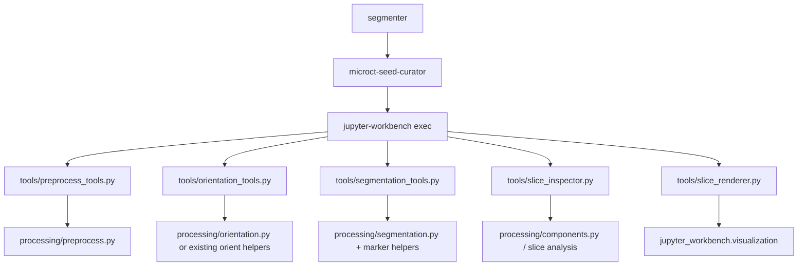
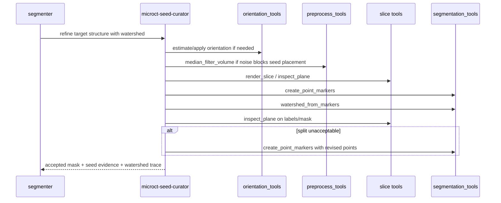

# Superseded target architecture: seed curation and watershed control

> [!NOTE]
> **Superseded target sketch.** This architect-spawn draft is preserved for audit history and external references. Use [Architecture](architecture.md) for module boundaries and API names, and [Behavioral spec](../spec/behavioral-spec.md) for exact requirements.


This historical draft turned the accepted decision into an initial sketch of module boundaries, API contracts, and interaction patterns. It is preserved for rationale; [Architecture](architecture.md) is now authoritative.

Related documents:
- [Decision record](seed-curation-decision.md)
- [Architecture options](seed-curation-options.md)
- [Design overview](../overview.md)
- [Authoritative architecture](architecture.md)
- [Behavioral spec](../spec/behavioral-spec.md)

## Package context



## Historical boundary decisions

### 1. Keep the seed loop in an agent substage

`microct-seed-curator` owns the iterative loop:
- choose a view plane and target slice
- inspect or render the anatomy
- place point markers
- run watershed
- evaluate and reseed until acceptable

This is intentionally **not** a single tool call. It is a judgment loop.

### 2. Add `tools/preprocess_tools.py`

Preprocessing is volume-level state preparation, not mask repair. Keep it out of
`segmentation_tools.py`.

Historical candidate surface:

```python
def median_filter_volume(
    volume,
    *,
    iterations: int = 3,
    size: int = 3,
) -> dict
```

Return contract:
- `volume`: filtered volume
- `parameters`: JSON-serializable filter parameters
- `summary`: shape, dtype, intensity range, and maybe a cheap histogram summary

Why separate:
- preprocessing may be reused outside watershed workflows
- it returns a transformed volume, not a mask
- volume transforms have different memory and provenance behavior from mask ops

### 3. Add `tools/orientation_tools.py`

Orientation changes the frame that later slice views, seed coordinates, and
measurements refer to.

Historical candidate surface:

```python
def estimate_orientation(label_mask, spacing, *, method="pca") -> dict
def orient_volume(volume, rotation, spacing, *, order=0) -> dict
```

The earlier draft considered a standalone `transform_points` helper. The
consolidated design keeps coordinate-transform metadata in `orient_volume`
outputs and seed evidence instead.

Why separate:
- orientation metadata is first-class evidence
- downstream calls need explicit transforms rather than hidden recipe state
- orientation may be reused by landmarking and measurement stages

### 4. Extend `tools/segmentation_tools.py` for marker-based watershed

Keep segmentation mechanics here, alongside the existing recipe-capable
segmentation boundary.

Historical candidate additions:

```python
def create_point_markers(
    volume_shape,
    points,
    labels,
    *,
    radius_voxels: int = 2,
    radius_mm: float | None = None,
    spacing=None,
) -> dict
def watershed_from_markers(
    volume,
    markers,
    *,
    mask=None,
    spacing=None,
    compactness: float = 0,
) -> dict
```

The earlier draft considered `select_watershed_label`; it is not part of the
authoritative initial API.

Key behavior:
- one point seed becomes one labeled spherical marker region
- marker spheres must remain non-touching; validation returns clear errors or
  warnings when labels collide
- watershed returns labeled output plus per-label summaries
- label selection stays explicit so the agent can inspect ambiguous splits

Recommended processing extraction:
- keep watershed math in `processing/segmentation.py`
- add a narrow marker helper there or in `processing/markers.py`
- do not hide marker creation in agent code

### 5. Keep slice inspection and rendering separate

Do **not** merge `slice_inspector.py` and `slice_renderer.py`.

Instead:
- keep pure per-slice summaries in `slice_inspector.py`
- keep PNG / 3D side effects in `slice_renderer.py`
- add plane-aware entrypoints while preserving axial wrappers

Historical candidate surface:

```python
# existing wrappers stay
render_axial(...)
inspect_slice(...)

# new plane-aware helpers
render_slice(volume, index, *, plane="axial", mask=None, points=None, title=None, output_path=None, spacing=None) -> dict
inspect_plane(mask, index, *, plane="axial", spacing=(1.0, 1.0, 1.0)) -> dict
```

The earlier draft called the rendering helper `render_plane`; the consolidated
API name is `render_slice`.

Why this split stays important:
- rendering depends on visualization/runtime details
- inspection depends on pure geometry/stat summaries
- they verify best at different seams

## Interaction pattern



## Data contracts

### Seed evidence

The substage should be able to persist a JSON record like:

```json
{
  "plane": "coronal",
  "slice_index": 181,
  "orientation_applied": true,
  "points_zyx": [[210, 181, 244], [211, 180, 267]],
  "radius_voxels": 2,
  "watershed_parameters": {"compactness": 0, "masked": true}
}
```

Why explicit evidence matters:
- seed placement is a meaningful anatomical decision
- downstream review needs more than the final mask
- replay can reconstruct the accepted watershed call from one cell

### Coordinate-frame rule

Any orientation tool that changes array orientation must return the transform
needed to map:
- original volume coordinates -> oriented coordinates
- oriented coordinates -> original coordinates

Seed-curator evidence must state which frame its points use.

## Scope boundaries

### In scope

- exposing deterministic preprocessing/orientation helpers to agents
- point-marker seed construction and marker-based watershed execution
- plane-aware slice review
- a dedicated seed-curation substage agent

### Out of scope

- changing measurement tool signatures
- folding all volume transforms into segmentation recipes
- turning every slice operation into a new standalone module
- human GUI seed editing; this remains agent-driven through workbench cells

## Historical migration path

1. add `preprocess_tools.py` and `orientation_tools.py` as additive modules
2. extend `segmentation_tools.py` with point-marker and watershed helpers
3. add plane-aware helpers while preserving existing axial wrappers
4. add evidence serialization for accepted seed/watershed runs
5. introduce `microct-seed-curator` under the existing segmenter pipeline

## Historical test seams

- **unit / focused tests**
  - marker creation from sparse points
  - collision validation for nearby markers
  - watershed result shape/label semantics
  - plane indexing helpers
  - orientation transform round-trips
- **integration tests**
  - seed-curator uses orientation + plane review + watershed tools coherently
- **smoke scenarios**
  - bridged-bone case where flood-fill seeds fail but point markers separate
  - noisy scan where median filtering improves seed stability

## External references

- scikit-image watershed API: https://scikit-image.org/docs/stable/api/skimage.segmentation
- SciPy multidimensional median filter: https://docs.scipy.org/doc/scipy/reference/generated/scipy.ndimage.median_filter.html
- scikit-image region properties with spacing support: https://scikit-image.org/docs/0.24.x/api/skimage.measure.html
