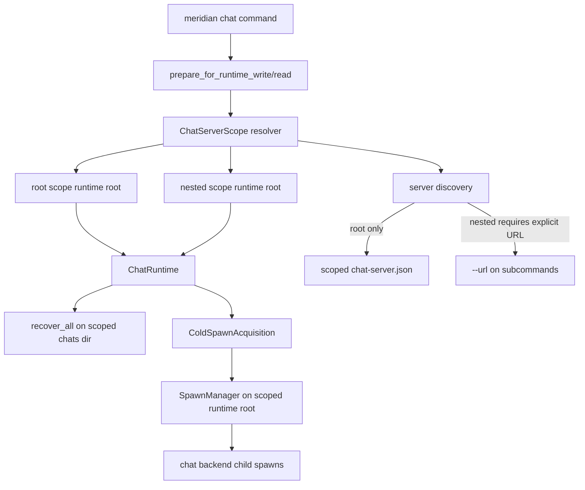
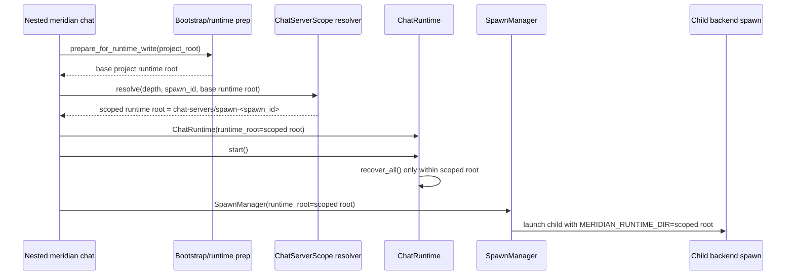

# Nested-safe chat launch target architecture

## Decision summary

Recommend **Option B: isolated runtime root per chat server scope**, with one refinement:

- do **not** place the nested runtime under spawn artifact files
- instead, place chat-owned runtime state under a dedicated subtree of the project runtime root

This gives nested chat servers a real isolation boundary without adding chat-specific ownership metadata to every recovered record.

## Why this option

The blanket nested-process guard is covering a **state-sharing problem**, not a launch problem.
Port binding, chat IDs, and shared policy resolution are already safe. The unsafe part is that the current chat server points `ChatRuntime`, recovery, discovery, and `SpawnManager` at shared user-home state.

The clean fix is to give each chat server its own runtime root.

## Option comparison

| Option | Summary | Isolation quality | Complexity | Reversibility | Testability | Verdict |
| --- | --- | --- | --- | --- | --- | --- |
| A. Guard removal + scoped discovery + ownership filtering | Keep shared runtime root; add discovery scoping and chat ownership markers | Medium-low | Medium-high | Medium | Medium | Reject |
| B. Isolated runtime root per chat server scope | Root and nested chat servers each get their own runtime subtree | High | Medium | High | High | **Recommend** |
| C. `--allow-nested` escape hatch | Keep current guard; add opt-in bypass | Low | Low | High | Low | Reject |

### Option A tradeoffs

Pros:

- smaller apparent surface change
- keeps current broad runtime layout

Cons:

- still shares `SpawnManager` state, control sockets, and spawn history namespace
- requires new ownership metadata and recovery filtering logic
- discovery ambiguity remains unless more scoping rules are added
- more fragile: correctness depends on every read path remembering to filter

### Option B tradeoffs

Pros:

- strongest boundary with the least behavioral coupling
- recovery becomes correct by construction: `recover_all()` only sees this server's chats
- `SpawnManager` isolation comes for free because it gets a different root
- no chat event schema or policy snapshot schema change required
- easy to smoke test with real nested launches

Cons:

- introduces a new runtime-root derivation path for chat
- root-server discovery policy now has to be expressed explicitly, even though the user-home singleton remains the root-scope discovery path
- leaves stale nested chat runtime directories behind until later cleanup work

### Option C tradeoffs

Pros:

- minimal code change

Cons:

- does not solve discovery collision
- does not solve recovery cross-talk
- does not solve shared spawn registry/control-socket state
- turns a safety bug into a user footgun

## Recommended architecture

### Runtime scoping model

Introduce a chat-only scope resolver responsible for deriving an isolated runtime root.

Suggested module boundary:

- `meridian.lib.chat.scope` or `meridian.lib.chat.runtime_scope`

Suggested data shape:

- `ChatServerScope`
  - `kind`: `root` | `nested`
  - `scope_id`: stable identifier (`root` or current `MERIDIAN_SPAWN_ID`)
  - `runtime_root`: isolated runtime root for this chat server
  - `discovery_path`: optional path for server URL discovery
  - `allow_implicit_discovery`: bool

### Scope resolution rules

1. Resolve the **base project runtime root** with existing bootstrap services.
2. Inspect Meridian context from environment.
3. If depth is `0`, use the **root chat scope**.
4. If depth is `> 0`, require `MERIDIAN_SPAWN_ID` and use a **nested chat scope** derived from that spawn id.
5. If depth is `> 0` and no spawn id is available, fail with a targeted error.

That replaces the blanket guard with a guard on the real invariant: **nested launch needs a stable ownership key**.

### Runtime layout

```text
# Root chat server — uses the base project runtime root directly
<project runtime root>/
  chats/                        # root server's chats
  spawns/                       # root server's backend spawns
  ...

# User-level discovery (UNCHANGED)
<get_user_home()>/
  chat-server.json              # user-level implicit discovery pointer (root writes this)

# Nested chat servers — isolated under chat-servers/
<project runtime root>/
  chat-servers/
    spawn-<spawn_id>/
      chats/
      spawns/
      ...RuntimePaths layout...
```

Notes:

- **Root discovery is unchanged**: root chat server writes the user-level `get_user_home()/chat-server.json` discovery pointer. Root chat state uses the base project runtime root selected by the scope resolver.
- `spawn-<spawn_id>/` isolates nested launches from both the root server and sibling nested servers.
- Nested servers do NOT write the user-level discovery file.
- Isolation is per parent spawn ID. **One chat server per spawn scope** is enforced: a lockfile under the scope directory prevents concurrent servers in the same scope. If a second launch attempts the same scope, it fails with a clear error.

### Discovery rules

- **Root scope**: write `chat-server.json` to `get_user_home()` (unchanged from today). Management subcommands at root read this file when `--url` is not provided.
- **Nested scope**: do NOT write any discovery file. Management subcommands at nested depth require `--url`.
- Nested `chat ls/show/log/close` without `--url` → fail with: "nested chat management commands require --url; implicit discovery is root-only."

This matches the intended usage:

- root shell: convenient implicit discovery (unchanged behavior)
- delegated/nested execution: explicit target only

### Per-spawn scope enforcement

Isolation is keyed by `MERIDIAN_SPAWN_ID`. This means one chat server per spawn scope by design. Enforcement:

- On nested startup, attempt to acquire an exclusive lockfile under the scope directory.
- If the lock is already held → fail with: "another chat server is running in this spawn scope."
- Lock released on shutdown (or stale after crash — next startup detects and reclaims).

### Child backend inheritance

All backends started from chat must inherit the chat server's isolated runtime root through existing launch env composition.

That means:

- `ChatRuntime(runtime_root=scope.runtime_root)`
- `_build_backend_acquisition(... runtime_root=scope.runtime_root)`
- `build_chat_backend_launch_plan(... runtime_root=scope.runtime_root)`
- `build_child_runtime_env_overrides(... runtime_root=scope.runtime_root)`

Result: backend child processes, control sockets, history files, and heartbeat state all remain inside the same isolated chat scope.

## Target-state component view



## Nested headless startup sequence



## Component-level changes

### 1. `src/meridian/cli/chat_cmd.py`

Change:

- remove `_require_root_process()` from `_chat()`
- remove `_require_root_process()` from `ls/show/log/close`
- replace with scope-aware behavior

New behavior:

- launch path resolves `ChatServerScope`
- nested launch allowed when scope resolution succeeds
- management subcommands:
  - root + no `--url`: use scoped discovery file
  - nested + `--url`: allowed
  - nested + no `--url`: fail with explicit message

Suggested error text:

```text
error: nested meridian chat management commands require --url; implicit chat discovery is root-scope only.
```

### 2. `run_chat_server()` runtime root wiring

Change the runtime root source from:

- current: `get_user_home()`

To:

- resolved chat scope runtime root

Also change `_write_server_discovery()` to use the `ChatServerScope` discovery path instead of deriving the path internally from `get_user_home()`.
For root scope, that scoped discovery path remains `get_user_home()/chat-server.json`; for nested scope, it is absent and no discovery file is written.

### 3. New chat scope resolver module

Responsibilities:

- derive root vs nested scope
- build deterministic scoped runtime paths
- expose discovery policy
- centralize the targeted nested invariant check

This should be the **only** place that knows chat runtime-root naming.

### 4. `src/meridian/lib/chat/server.py`

The fallback `configure()` path should stop defaulting chat runtime to `get_user_home()`.

Preferred direction:

- production launch always passes a fully constructed `ChatRuntime`
- the fallback path remains test-only / sentinel-friendly
- if an implicit runtime root is still needed, route it through the same chat scope helper rather than user-home globals

### 5. Recovery and runtime modules

Minimal or no logic change needed in:

- `src/meridian/lib/chat/runtime.py`
- `src/meridian/lib/chat/recovery.py`
- `src/meridian/lib/streaming/spawn_manager.py`

Reason:

- once the runtime root is isolated, existing recovery and spawn-management behavior becomes safe by construction

This is the main structural benefit of Option B.

### 6. Tests and smoke guides

Update:

- `tests/integration/cli/test_cli_main.py`
- `tests/integration/chat/test_chat_cli.py`
- `tests/smoke/chat/test_cli_startup.md`
- `tests/smoke/chat/test_shared_policy_surface.md`
- `docs/chat.md`
- `docs/commands.md`

Add coverage for:

- nested `meridian chat --headless` succeeds with scoped runtime root
- nested launch does not overwrite root discovery
- nested launch does not recover root chats
- nested `chat ls/show/log/close` require `--url`
- root discovery still works without `--url`

## Rejected alternative detail: why not filter recovered chats in a shared root?

Filtering sounds cheaper, but it pushes correctness into metadata discipline.

A shared-root design would need at least:

- per-chat ownership metadata
- recovery filtering before live registration
- discovery scoping
- likely spawn ownership scoping as well
- tests for every path that loads chat state from disk

That is more coupling than adding one explicit runtime boundary.

## Risk assessment

### Low risk

- policy resolution: unchanged
- port allocation: unchanged
- chat ID generation: unchanged
- normalizer selection and backend acquisition flow: unchanged except for scoped runtime root input

### Medium risk

- discovery-policy branching: existing tests and docs assume `~/.meridian/chat-server.json` is always written/read; they need to say it is root-scope only
- callers or tests that monkeypatch `get_user_home()` to control chat runtime location will need to patch the new scope helper instead
- parallel root chat servers in the same project still share the `root` scope by design

### High risk

- none if runtime-root scoping is implemented centrally and all chat runtime entry points use it

### Operational residue

Nested chat runtime directories may accumulate after smoke runs or crashed delegated sessions.
This is acceptable for the first rollout because:

- crash-only design prefers durable residue over implicit cleanup
- residue is scoped and cannot bleed into root chat state
- cleanup can be added later as a separate root-only maintenance feature

## Migration path

### Is this a breaking change?

**No for root flows; yes for nested (previously blocked).**

Behavior changes:

1. Root chat server implicit discovery remains **unchanged** — `get_user_home()/chat-server.json`. Root chat state is scoped through the same resolver as nested state and lands in the base project runtime root.
2. Nested chat launch becomes **allowed** (previously hard error).
3. Nested chat management without `--url` becomes an explicit error (previously also hard error, so net behavior change is: "error message changes").
4. Nested chat servers get isolated state under `<project runtime root>/chat-servers/spawn-<id>/`.

### Migration strategy

Do **not** migrate old chat state.

Reason:

- chat sessions are local, ephemeral runtime state
- no backward-compatibility requirement exists for this repo
- migrating existing chat state into newly scoped runtime roots adds complexity to a low-value path

### Rollout steps

1. Add the chat scope resolver and scoped runtime-root layout.
2. Rewire `run_chat_server()` and discovery helpers to use it.
3. Remove the blanket nested guard.
4. Add nested launch and no-bleed tests.
5. Update smoke docs and command docs.

## Final recommendation

Implement **Option B with a dedicated chat scope subtree under the project runtime root**.

It is the best fit for Meridian's architecture principles:

- **separate policy from mechanism**: scope resolution is explicit and centralized
- **single responsibility**: chat scoping lives in one helper, not spread across recovery paths
- **files as authority**: isolation is expressed in directory layout, not hidden in process memory
- **crash-only design**: each server owns durable residue in its own scope
- **simplest orchestration that works**: one runtime boundary deletes multiple classes of cross-talk at once
