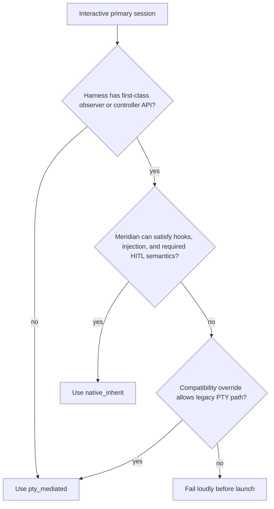
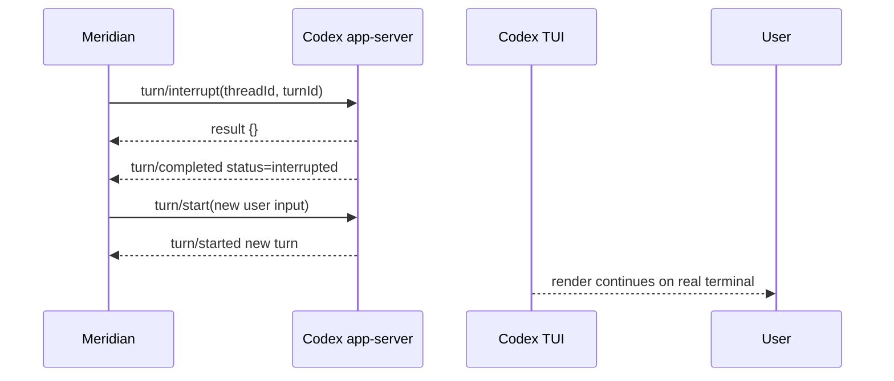

# Harness Launch and Control Matrix

See also: [recommended-architecture.md](recommended-architecture.md), [permission-hitl-routing.md](permission-hitl-routing.md)

## Recommended matrix

| Harness | Terminal surface default | Observer/control plane | Native attach command | Inject-only | Interrupt + inject | Runtime permission path | Fallback policy |
| --- | --- | --- | --- | --- | --- | --- | --- |
| Claude | `pty_mediated` | none equivalent today | n/a | unsupported in this design | unsupported in this design | existing Claude CLI semantics only | keep current behavior |
| Codex | `native_inherit` | `codex app-server` JSON-RPC over WS | `codex resume <thread> --remote <ws>` | `turn/steer` when a steerable turn is active, else `turn/start` | `turn/interrupt` -> wait for matching `turn/completed` -> `turn/start` | JSON-RPC server requests + JSON-RPC responses | compatibility fallback to managed sidechannel + PTY only; do not fall back to black-box when hooks/HITL/injection are required |
| OpenCode | `native_inherit` | `opencode serve` HTTP + SSE | `opencode attach <http_url> --session <id>` | prefer `POST /session/:id/prompt_async`; fallback `POST /session/:id/message` only if async path unavailable | `POST /session/:id/abort` -> wait for abort completion signal -> `POST /session/:id/prompt_async` | SSE-observed permission requests + `POST /session/:id/permissions/:permissionID` replies | compatibility fallback to managed sidechannel + PTY during rollout; black-box fallback only when control-plane features are not required |

## Terminal-mode selection



## Harness-specific notes

### Claude

Claude remains the control case for PTY mediation.

Reasons:

- no equivalent side-channel observer/controller exists in current Meridian architecture;
- removing PTY for Claude would remove current observability rather than improving it;
- the work item explicitly says Claude must not regress.

### Codex

Codex already has the right architectural shape for no-PTY interactive sessions:

- a managed backend process (`codex app-server`);
- an ordered side-channel event stream;
- explicit turn start, steer, and interrupt operations;
- server-initiated runtime approval and user-input requests.

The main design risk is not launch feasibility. It is **turn fencing** after interrupt.

#### Codex inject-only semantics

| Session state | Operation | Expected behavior |
| --- | --- | --- |
| active steerable turn | `turn/steer(expectedTurnId=active_turn)` | same-turn steering |
| no active turn | `turn/start` | new turn starts immediately |
| active non-steerable turn | reject inject-only and require caller to use interrupt-first | avoids ambiguous behavior |

#### Codex interrupt-then-inject semantics



Rules:

- wait for the **matching** interrupted turn's `turn/completed` before starting the injected turn;
- do not treat `{}` from `turn/interrupt` as completion;
- late old-turn output stays in history but is marked stale.

### OpenCode

OpenCode also has the right architectural split:

- `opencode serve` is already a headless server;
- the TUI is already a client of that server;
- the server exposes HTTP endpoints plus SSE;
- runtime permission response endpoints exist upstream.

The key improvement over earlier smoke evidence is that upstream now documents `POST /session/:id/prompt_async`, which is a better inject-only transport than blocking `POST /session/:id/message`.

#### OpenCode inject-only semantics

| Preferred path | Why |
| --- | --- |
| `POST /session/:id/prompt_async` | asynchronous fire-and-forget enqueue; does not block Meridian's control loop |
| fallback `POST /session/:id/message` | only for compatibility when async path is unavailable |

#### OpenCode interrupt-then-inject semantics

| Step | Operation | Completion gate |
| --- | --- | --- |
| 1 | `POST /session/:id/abort` | transport success only means request accepted |
| 2 | wait for SSE or session-state evidence that the aborted turn is done | avoid racing new input into the aborted turn |
| 3 | `POST /session/:id/prompt_async` | inject the new user message |

Because OpenCode abort semantics are protocol-aware rather than shell-process-only, Meridian must interpret abort from structured events, not from tool `state.status` alone.

## Compatibility policy

### Automatic fallback allowed

Automatic fallback is acceptable only when the session has not yet become visible to the user and the fallback still preserves required control-plane semantics.

### Automatic fallback not allowed

Do **not** silently fall back to a black-box TUI path when the session needs:

- hooks on structured events;
- external injection;
- runtime permission/HITL routing.

That fallback would satisfy rendering only while violating the actual contract of this feature.

## Launch-boundary implications

The process-launch selector should no longer infer terminal behavior indirectly from capture needs.

It should instead take a resolved harness decision:

```text
terminal_surface_mode = native_inherit | pty_mediated
```

That keeps the launch boundary honest:

- harness adapter chooses capabilities;
- launch resolution chooses policy;
- process launcher executes the chosen terminal mode.
