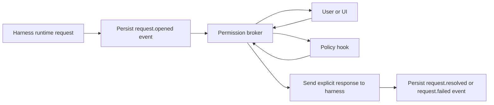

# Permission and HITL Routing

See also: [recommended-architecture.md](recommended-architecture.md), [harness-launch-control-matrix.md](harness-launch-control-matrix.md)

## Design goal

Native terminal rendering must not imply control-plane detachment.

Meridian still needs to see runtime approval and user-input requests, route them through policy or humans, and send responses back to the harness without introducing a default-deny regression.

## Recommendation

Add a **Permission Broker** between harness connections and the rest of Meridian.

Responsibilities:

- surface runtime approval and user-input requests as durable events;
- keep request state (`pending`, `resolved`, `failed`, `cancelled`);
- route requests to users and/or policy hooks;
- send explicit responses back to the harness;
- persist the final resolution result.

## Dataflow



## Default-deny prevention rule

The broker must never convert "Meridian has not answered yet" into "reject".

Required behavior:

- unresolved request state is `pending`;
- only an explicit policy or human action sends `approve`, `reject`, or structured answers;
- session termination can cancel a pending request, but must not pretend the request was rejected by policy;
- launch-time configuration must not silently install a request handler that rejects runtime requests for lack of a better path.

This is the core guard against repeating the previous default-deny behavior.

## Approval-mode mapping

| Meridian approval mode | Broker behavior |
| --- | --- |
| `yolo` | auto-approve and persist that Meridian made the decision |
| `auto` | allow policy hooks to auto-decide; otherwise leave pending and surface to user |
| `confirm` | always surface to user unless an explicit policy hook is configured to answer |
| `default` | preserve harness-default launch policy, but if a runtime request still arrives, treat it as a real pending request and broker it |

The key rule is that **runtime request arrival wins over assumptions**. If the harness asked, Meridian must broker the request.

## Codex routing

### Inbound requests

Codex side-channel requests arrive as JSON-RPC server requests such as approval or user-input prompts.

Required Meridian behavior:

1. persist `request.opened` with request id, thread id, turn id, item id if known, and request payload;
2. expose the request to user/UI and policy hooks;
3. send the explicit JSON-RPC result only after Meridian has a real decision;
4. persist `request.resolved` after the response is accepted or the matching `serverRequest/resolved` event arrives.

### Codex-specific guardrail

For no-PTY managed primary sessions, Meridian should use a broker-backed interactive request handler, not an auto-answer or auto-reject handler, whenever runtime approvals may occur.

A request handler that rejects approvals because the mode is `confirm` is structurally wrong for this architecture.

## OpenCode routing

### Inbound requests

The upstream server exposes a permission response endpoint:

- `POST /session/:id/permissions/:permissionID`

The missing piece to verify is the exact event shape by which the active permission request appears on SSE or the event bus.

Required Meridian behavior once verified:

1. persist `request.opened` with session id and permission id;
2. surface the request to user/UI and policy hooks;
3. send `POST /session/:id/permissions/:permissionID` with the explicit response;
4. persist `request.resolved` when the server confirms the request is closed.

### Probe gate

OpenCode no-PTY should not become the default until Meridian verifies:

- where permission requests appear (`/event`, `/global/event`, or a session-specific stream);
- how the request is correlated to the running turn;
- whether user-input prompts follow the same or a separate API path.

If OpenCode exposes the request only through another documented control surface, Meridian should use that first-class surface rather than inventing a transport proxy.

## Request state model

Recommended persistent state:

```text
PendingRequest
  request_id
  session_id
  turn_id?
  item_id?
  harness_id
  request_type           # approval | user_input
  opened_seq
  status                 # pending | resolved | failed | cancelled
  resolution_seq?
  payload
```

This state can be materialized from persisted events or stored as a derived index. The append-only event stream remains the authority.

## Hooks and permissions

Hooks that inspect requests should be divided by capability:

- **passive hooks** may observe every request event;
- **advisory hooks** may emit recommendations but cannot close the request by themselves unless explicitly configured;
- **policy hooks** may decide allow or deny;
- **mutation hooks** may answer user-input prompts or trigger follow-up injections.

The Permission Broker, not the hook subprocess, should own the final harness response call. Hooks return decisions into Meridian; Meridian sends the wire response.

That keeps policy separate from transport and preserves auditability.

## Replay and resume behavior

On resume:

1. rebuild pending request state from persisted request events and resolution events;
2. do not re-run previously acknowledged policy decisions;
3. re-surface only requests still marked `pending`;
4. ignore stale requests attached to interrupted and superseded turns unless the harness still marks them open.

This prevents duplicate approvals and prevents hooks from re-answering a request Meridian already resolved.
