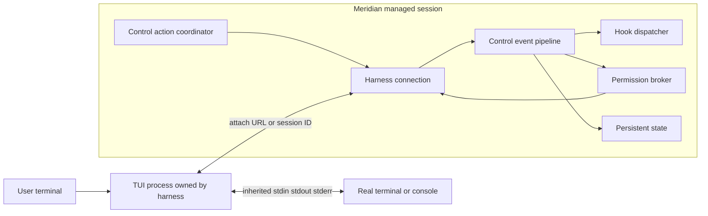
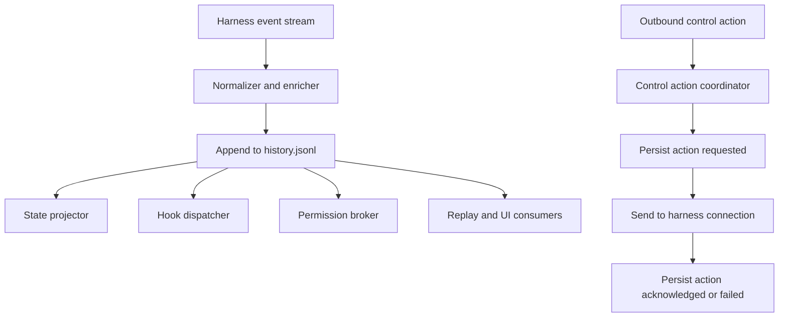

# Recommended Architecture

See also: [../overview.md](../overview.md), [../../requirements.md](../../requirements.md)

## Architectural goal

For harnesses with a first-class side-channel API, Meridian should stop pretending the terminal stream is the control plane.

The terminal surface and the control surface should be separate concerns:

- the **harness TUI** owns screen painting, cursor state, resize handling, and terminal UX;
- **Meridian** owns event observation, durable history, hooks, permission policy, control actions, and replay.

## Recommended boundary split



## Structural recommendation

### 1. Add an explicit terminal-surface decision

Interactive primary launch should resolve a **terminal surface mode** per harness:

- `native_inherit`
- `pty_mediated`

This must be a first-class resolved field, not an incidental effect of `output_log_path` or launcher selection.

Recommended resolution rule:

1. if harness lacks a first-class observer/controller API, choose `pty_mediated`;
2. if harness has a first-class observer/controller API and Meridian can satisfy hooks, injection, and runtime permission routing, choose `native_inherit`;
3. allow an explicit compatibility override to force `pty_mediated` during rollout.

### 2. Keep managed-primary sidechannel ownership

For Codex and OpenCode, Meridian should still own the managed backend lifecycle:

- start the side-channel backend;
- obtain the harness session/thread id;
- persist ordered events to durable history;
- route approvals and user-input requests;
- serialize outbound control actions;
- stop the backend when the primary session ends.

The change is only that the attached TUI process should run against the user's real terminal instead of Meridian's PTY wrapper when `terminal_surface_mode == native_inherit`.

### 3. Introduce a control action coordinator

Outbound mutations should not be fired ad hoc from random call sites.

Add one coordinator responsible for serializing control actions per live session:

- `interrupt_turn`
- `inject_user_message`
- `reply_permission_request`
- `reply_user_input_request`

The coordinator owns ordering, retry policy, and interrupt fencing.

### 4. Make persisted events the authority for session state

`history.jsonl` should remain append-only, but its envelope should be upgraded from raw transport capture to **causal event persistence**.

Recommended per-event fields:

- `seq`
- `recorded_at`
- `harness_id`
- `event_type`
- `payload`
- `session_id`
- `turn_id`
- `item_id`
- `request_id`
- `lane` (`turn`, `item`, `request`, `control`, `warning`)
- `interrupt_epoch`
- `stale_after_interrupt`
- `raw_text` (debug only)

Not every harness event natively carries all ids. The pipeline should enrich events using harness-specific correlation tables, for example:

- item id -> turn id
- request id -> turn id
- session id -> current interrupt epoch

## Control pipeline



## Session-state model

### Session controller boundary

Every no-PTY-capable harness should present the same Meridian-facing contract:

- start observer/controller backend;
- expose session id once ready;
- expose ordered event stream;
- support cancel semantics;
- support user-message injection semantics;
- support runtime permission response semantics when the harness supports them;
- expose the TUI attach command for native terminal rendering.

That boundary already mostly exists in `HarnessConnection` plus passthrough builders. The design change is to make **terminal ownership** an explicit part of the contract rather than an implicit launcher choice.

### Control action boundary

Recommended durable control action shape:

```text
ControlAction
  id
  kind                # interrupt | inject | permission_reply | user_input_reply
  session_id
  turn_id?            # required for scoped interrupt when harness supports it
  mode?               # inject_only | interrupt_then_inject
  payload
  status              # requested | sent | acknowledged | failed | cancelled
  created_at
  acknowledged_at?
```

This queue can live in its own file or as synthetic control events in the same append-only history. Either way, Meridian needs a durable record of outbound actions so resume/recovery does not guess.

## Interrupt fencing and stale Codex output

Codex is the hardest case because `turn/interrupt` can logically complete a turn while old tool output continues to stream afterward.

Meridian should **not** treat late output as a transport bug to hide. It should treat it as valid but stale data tied to an older turn.

Recommended rule set:

1. On every interrupt request, increment `interrupt_epoch` for the session.
2. Persist the interrupt request as a control action.
3. Wait for `turn/completed` for the interrupted turn before allowing `interrupt_then_inject` to start a new turn.
4. If later events arrive for the interrupted turn after a newer turn is active, persist them with:
   - original `turn_id`
   - current `interrupt_epoch`
   - `stale_after_interrupt = true`
5. UI projections must not merge stale events back into the active turn pane.
6. Mutation hooks and permission workflows must ignore stale events.
7. Passive logging and forensic history should still retain them.

This preserves correctness without pretending the old process output never existed.

## Replay and resume without duplicate side effects

Replay and hook dispatch should be separate concerns.

### Replay

Replay is allowed to read any persisted event from sequence `0..N` for UI and diagnostics.

### Hook and mutation dispatch

Hooks that can cause side effects must advance from a durable consumer cursor, not from full-log replay.

Recommended rule set:

- each side-effecting consumer keeps a durable `last_applied_seq` cursor;
- cursor advances only after the consumer finishes the side effect or intentionally records a skip;
- non-idempotent consumers also keep an event-id dedupe set for crash windows between external effect and cursor advance;
- resume rehydrates session state from history first, then resumes side-effect consumers from their cursors.

This gives effectively-once dispatch for one-time hooks without preventing full UI replay.

## Why Claude stays PTY-mediated

Claude still lacks the same class of side-channel boundary Meridian already uses for Codex and OpenCode.

Therefore Claude still needs PTY mediation for Meridian to:

- observe interactive session behavior at all;
- preserve current session-id extraction and launch semantics;
- keep compatibility with current interactive spawn behavior.

The design is deliberately harness-specific:

- **Codex/OpenCode**: sidechannel-native terminal rendering
- **Claude**: PTY-mediated terminal rendering

## Cross-platform behavior

### POSIX

For `native_inherit`, Meridian should launch the attached TUI with inherited stdin/stdout/stderr and no PTY wrapper.

Consequences:

- no SIGWINCH forwarding layer in Meridian;
- no PTY byte copying loop;
- the harness TUI talks to the real terminal directly.

### Windows

For `native_inherit`, Meridian should rely on console inheritance, not emulate PTY behavior.

Consequences:

- no attempt to introduce a POSIX-style PTY abstraction on Windows;
- the TUI should inherit the real console directly;
- the side-channel backend should remain headless and must not contend for the console.

This matches the requirement that Windows be first-class without inventing a second terminal mediation subsystem.

## Rejected structural alternative

Do not put Meridian back into the terminal path via websocket MITM, terminal-byte interception, or transport proxying unless a harness truly lacks a first-class observer/control API for the needed feature.

That would re-couple rendering and control and would recreate the exact class of fragile behavior this work item is trying to remove.
