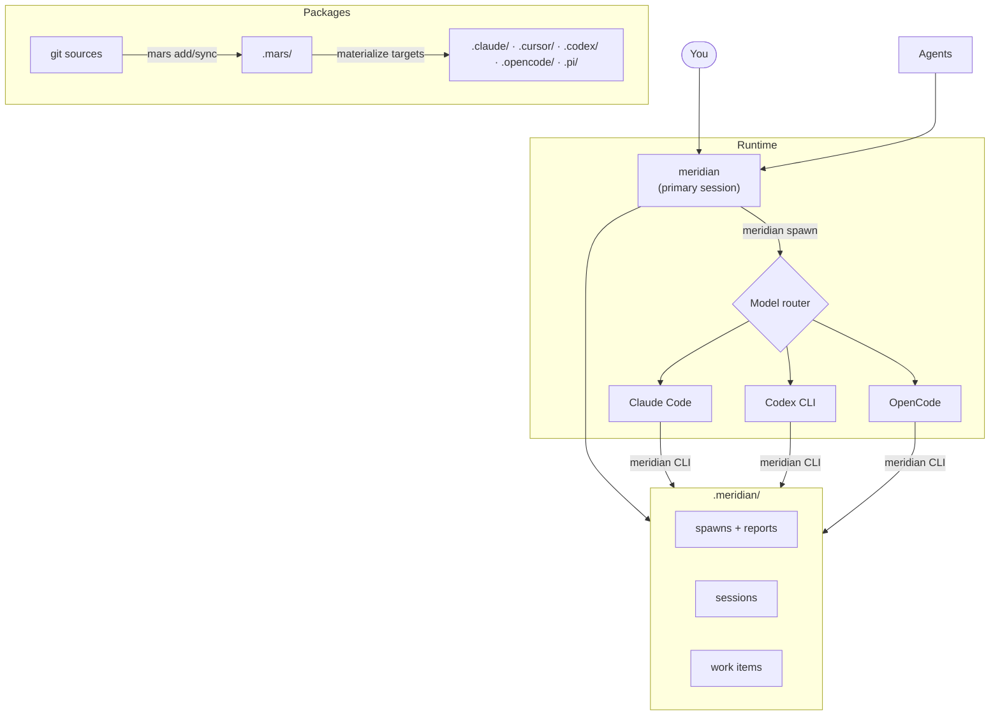

# meridian-cli

Let coding harnesses call each other. meridian-cli lets agents running in Claude Code, Codex CLI, and OpenCode spawn named specialist agents in the other harnesses, each with the model, cost, and tool environment you configured.

It is for people who already use more than one AI coding CLI and want one team of agents instead of separate chat sessions.

> **Early development.** meridian-cli is not stable. Expect breaking changes in any release. If you need a stable workflow, this project is not ready for you yet.

## Why

Good agentic coding is an allocation problem. Some tasks need the strongest model you have; some need cheap, parallel throughput; some need a specific harness feature such as sandboxing, tool behavior, context handling, or integrations.

Without meridian-cli, those choices are trapped inside separate CLIs. Switching harnesses means manually copying context between sessions and hoping the next agent understands what happened.

meridian-cli turns that handoff into a command. A caller can delegate to a named specialist, pass only the context that agent needs, and pick up the result from disk. Use the expensive model where judgment matters, use cheaper agents where throughput matters, and keep every agent inside the harness that fits the job.

## One Harness Can Call Another

> **Demo placeholder:** add a short terminal recording or screenshot here showing one coding harness spawning an agent in another harness, then collecting the result with `meridian spawn wait` or `meridian spawn show`.

## Install

```bash
uv tool install meridian-cli
```

The package is `meridian-cli`; the command it installs is `meridian`.

<details>
<summary>Other methods</summary>

```bash
pipx install meridian-cli
pip install meridian-cli
```

From source:

```bash
git clone https://github.com/haowjy/meridian-cli.git
cd meridian-cli
uv tool install --force . --no-cache --reinstall
```

</details>

You need at least one harness installed: [Claude Code](https://docs.anthropic.com/en/docs/claude-code), [Codex CLI](https://github.com/openai/codex), or [OpenCode](https://opencode.ai).

## Set Up a Project

`meridian init` by itself only bootstraps meridian-cli project config:

```bash
meridian init
```

To initialize Mars package content in the same step, use setup flags:

```bash
meridian init --add haowjy/meridian-dev-workflow --link .claude
```

For first-run onboarding, bootstrap can do setup + launch in one command:

```bash
meridian bootstrap --add haowjy/meridian-dev-workflow --link .claude
```

`--add` / `--link` setup flags cannot be combined with `--dry-run`.

## Usage

Launch an interactive session:

```bash
meridian
```

Or spawn agents directly:

```bash
# Code on Codex, review on Claude
meridian spawn -a coder -p "Add rate limiting to the API endpoints"
meridian spawn -a reviewer --from p1 -p "Review the rate limiting implementation"

# Check on work
meridian spawn list
meridian spawn show p1
```

Agents route to their configured model and harness automatically. Each spawn gets a fresh context window with only the context it needs.

## Architecture



## Agent Packages

**[meridian-dev-workflow](https://github.com/haowjy/meridian-dev-workflow)** — A dev team: architects, coders, reviewers, testers, researchers, documenters, and the orchestrators that coordinate them.

**[meridian-base](https://github.com/haowjy/meridian-base)** — Core coordination primitives. Included as a dependency of meridian-dev-workflow.

## Docs

- [Getting Started](docs/getting-started.md) — prerequisites, harness setup, tool integration
- [Commands](docs/commands.md) — full CLI reference
- [Configuration](docs/configuration.md) — config keys, state layout, environment variables
- [MCP Tools](docs/mcp-tools.md) — tool surface and payload examples
- [Troubleshooting](docs/troubleshooting.md) — common issues and diagnostics
- [INSTALL.md](INSTALL.md) — agent-friendly install guide

## Development

```bash
uv sync --extra dev
uv run ruff check .
uv run pytest-llm
uv run --extra dev python -m pyright
```

See [DEVELOPMENT.md](DEVELOPMENT.md) for full dev setup.

## Contributing

This project is not accepting external contributions at this time. The maintainer is keeping it closed to outside contributions until the codebase is stable enough to support them well. Bug reports and feedback are welcome as GitHub issues.

## License

[Apache 2.0](LICENSE)
