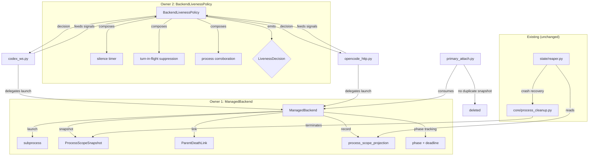
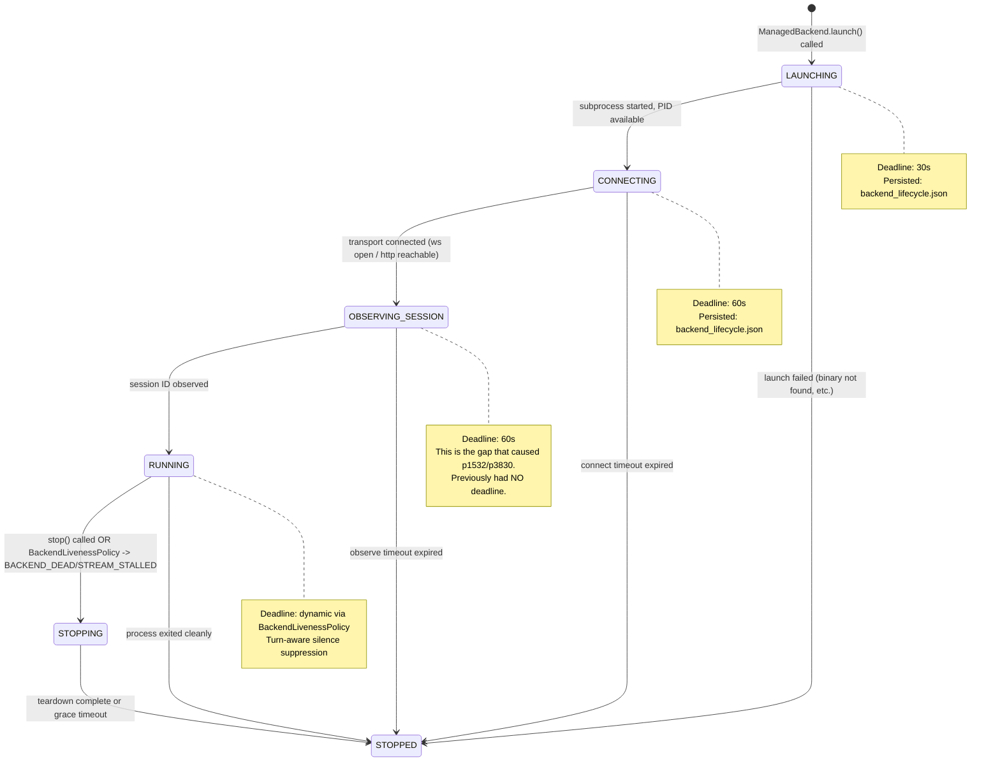

# Design: Managed-Backend Lifecycle Ownership

## 1. IS (current) vs SHOULD (proposed)

### Current: ~13-site fragmentation

No component owns the lifecycle of a managed harness backend. Each phase
and each death mode is handled by whichever file was nearest when the bug
was found.

```
                     Launch                  Observe          Run / Liveness              Death / Teardown
                     ------                  -------          --------------              ----------------
codex_ws.py          subprocess_exec         ws connect       EventStreamLiveness         _cleanup_resources
                     scope snapshot          initialize       mark_activity               process.terminate
                     parent-death link       turn bootstrap   health()
                     record_scope

opencode_http.py     subprocess_exec         http polling     EventStreamLiveness         _cleanup_runtime
                     scope snapshot          session create   mark_activity               process.terminate
                     parent-death link       session observe  health()
                     record_scope

primary_attach.py    (delegates to conn)     session_id obs   _run_event_writer           connection.stop()
                     _make_scope_snapshot    record backend   _update_activity            _terminate_tui_scope
                     record_scope (2nd)      scope            _set_activity

streaming/           ---                     ---              _stop_connection_with_      stop_spawn
spawn_manager.py                                             scope_safety (safety kill)  _cleanup_completed_session

state/reaper.py      ---                     ---              decide_reconciliation       terminate_spawn_scopes
                                                             is_process_alive             terminate_managed_primary_processes
                                                             artifact/heartbeat

state/               ---                     ---              launcher_pid_alive          terminate_managed_primary_processes
managed_primary.py                                           ManagedPrimaryReconciliation

core/                ---                     ---              ---                         terminate_spawn_scopes
process_cleanup.py                                                                       terminate_recorded_spawn_scopes
                                                                                         cancel_managed_primary
                                                                                         should_skip_cleanup

state/liveness.py    ---                     ---              is_process_alive             ---
                                                             is_spawn_genuinely_active

platform/            detached_backend_       ---              ---                         ---
detached_process.py  subprocess_kwargs
                     link_child_lifetime

platform/            ---                     ---              ---                         terminate_scope_sync
process_scope/                                                                           terminate_tree
```

**Key observation:** The "launch + scope snapshot + parent-death link + record_scope"
sequence is copy-pasted three times (codex, opencode, primary_attach), and the
"is this thing dead enough to kill?" question is answered by five different modules
(liveness.py, health(), reaper, managed_primary, spawn_manager safety kill).

### Proposed: Two owners + aggressive deletion



## 2. Key Interfaces

### Owner 1: `ManagedBackend` (new, in `harness/connections/managed_backend.py`)

This is a value-carrying process owner, not a god-object. It launches,
snapshots, links, records, and tracks phase. It does NOT own the transport
connection or event stream -- those remain in the adapter.

```python
@dataclass
class ManagedBackendConfig:
    """Inputs for launching a managed backend process."""
    spawn_id: SpawnId
    harness_id: HarnessId
    command: tuple[str, ...]
    cwd: Path
    env: dict[str, str]
    control_root: Path
    stderr_log_path: Path
    observer_mode: bool  # suppresses record_scope when True


class BackendPhase(StrEnum):
    """Lifecycle phases with associated deadlines."""
    LAUNCHING = "launching"           # subprocess_exec -> pid available
    CONNECTING = "connecting"         # transport handshake (ws/http)
    OBSERVING_SESSION = "observing"   # waiting for session ID
    RUNNING = "running"               # normal operation
    STOPPING = "stopping"             # teardown in progress
    STOPPED = "stopped"               # terminal


@dataclass(frozen=True)
class PhaseDeadline:
    """One phase's timeout constraint."""
    phase: BackendPhase
    deadline_epoch: float
    timeout_seconds: float


@dataclass(frozen=True)
class ManagedBackendHandle:
    """Returned after successful launch. Immutable facts about the backend."""
    process: asyncio.subprocess.Process
    pid: int
    scope_snapshot: ProcessScopeSnapshot
    scope_handle: ScopedProcessHandle
    parent_death_link: ParentDeathLink


class ManagedBackend:
    """Single owner of managed backend process lifecycle facts."""

    async def launch(self, config: ManagedBackendConfig) -> ManagedBackendHandle:
        """Launch subprocess, build scope snapshot, link parent death, record scope.

        Performs the entire sequence that is currently copy-pasted across
        codex_ws._launch, opencode_http._launch_process, and
        primary_attach._make_scope_snapshot + record_scope.

        Phase transitions: LAUNCHING -> (caller advances to CONNECTING)
        """
        ...

    def advance_phase(self, phase: BackendPhase, timeout_seconds: float) -> PhaseDeadline:
        """Record a phase transition and arm the deadline for the new phase.

        Returns the deadline so the caller can integrate it into their
        event loop (asyncio.wait_for, etc.).
        """
        ...

    @property
    def current_phase(self) -> BackendPhase: ...

    @property
    def current_deadline(self) -> PhaseDeadline | None: ...

    def phase_expired(self) -> bool:
        """True if the current phase's deadline has passed."""
        ...

    def persist_phase(self) -> None:
        """Atomically write current phase + pid + scope to the spawn sidecar.

        Written at each phase transition. Enables crash recovery:
        the reaper reads this to know what phase the backend was in
        when the worker died.
        """
        ...
```

**What it absorbs:**
- `codex_ws.py` lines 353-408 (subprocess launch, scope build, parent-death link, record_scope)
- `opencode_http.py` lines 459-523 (same sequence, duplicated)
- `primary_attach.py` `_make_scope_snapshot()` (lines 39-78) and its `record_scope` call (lines 212-232)
- `platform/detached_process.py` `detached_backend_subprocess_kwargs()` and `link_child_lifetime_to_parent()` -- consumed internally, not re-exported

**What it does NOT absorb:**
- Transport-level connection (ws handshake, http polling) -- stays in adapters
- Event streaming -- stays in adapters
- Activity tracking -- stays in Owner 2
- Teardown execution -- stays in `process_cleanup.py`

### Owner 2: `BackendLivenessPolicy` (deepened from `harness/connections/liveness.py`)

The current `EventStreamLiveness` is a bare timer. This deepens it into a
composed decision-maker that absorbs the policy logic currently scattered
across both adapters' `health()` methods and the spawn_manager safety kill.

```python
class LivenessDecision(StrEnum):
    """Structured outcome from a liveness evaluation."""
    CONTINUE = "continue"              # all signals healthy
    SUPPRESS = "suppress"              # silence detected but turn in-flight
    BACKEND_DEAD = "backend_dead"      # process corroboration confirms death
    STREAM_STALLED = "stream_stalled"  # silence + no turn + process alive


class BackendLivenessPolicy:
    """Composed liveness decision-maker.

    Consumes three signal sources:
    1. Silence timer (existing EventStreamLiveness, internalized)
    2. Turn-in-flight state (fed by adapter via signal_turn_started/ended)
    3. Process corroboration (via state/liveness.is_process_alive)

    The adapters feed it signals and obey its decision. They never
    independently decide "am I dead?" -- that question has one owner.
    """

    def __init__(
        self,
        *,
        timeout_seconds: Callable[[], float],
        now: Callable[[], float],
        backend_pid: Callable[[], int | None],
        backend_birth_time: Callable[[], float | None],
    ) -> None: ...

    # -- Signal inputs (called by adapters) --
    def mark_activity(self) -> None: ...
    def mark_activity_if_idle(self) -> None: ...
    def signal_turn_started(self, turn_id: str) -> None: ...
    def signal_turn_ended(self, turn_id: str) -> None: ...
    def signal_request_in_flight(self, request_id: str) -> None: ...
    def signal_request_resolved(self, request_id: str) -> None: ...

    # -- Decision output --
    def evaluate(self) -> LivenessDecision:
        """Single point of truth: is this backend alive?

        Logic:
        1. If silence timer not expired -> CONTINUE
        2. If turn/request in-flight -> SUPPRESS (do not kill)
        3. If backend PID is dead (via is_process_alive) -> BACKEND_DEAD
        4. Backend PID alive but stream silent -> STREAM_STALLED
        """
        ...

    # -- Async wait (replaces EventStreamLiveness.wait_for_activity) --
    async def wait_for_activity(self, awaitable: Awaitable[T]) -> T:
        """Like EventStreamLiveness.wait_for_activity but raises only
        when evaluate() says BACKEND_DEAD or STREAM_STALLED, not on
        bare silence timeout when a turn is in-flight."""
        ...

    @property
    def healthy(self) -> bool:
        """For connection.health() -- True unless evaluate() is a death signal."""
        return self.evaluate() in (LivenessDecision.CONTINUE, LivenessDecision.SUPPRESS)
```

**What it absorbs:**
- `harness/connections/liveness.py` `EventStreamLiveness` -- internalized, not re-exported
- `codex_ws.py` `health()` turn-suppression logic (lines 519-527)
- `opencode_http.py` `health()` logic (lines 325-331)
- `state/liveness.py` `is_process_alive` -- consumed as corroboration primitive (module stays, but the decision to call it moves here)
- `spawn_manager.py` `_stop_connection_with_scope_safety` post-stop PID check (lines 922-963) -- the "is the process still alive after stop?" question becomes `policy.evaluate()` returning `BACKEND_DEAD`, and the safety-kill becomes a natural consequence of the policy saying "dead"

**What it does NOT absorb:**
- `state/liveness.py` itself (stays as a primitive)
- Reaper reconciliation logic (different concern: crash recovery vs live supervision)

### Phase/Deadline Model

Every phase before `running` gets a deadline. This directly closes the
takeover-phase timeout gap (requirement #2, specimens p1532/p3830).

```
LAUNCHING          timeout: 30s   (subprocess started, waiting for port/ws)
CONNECTING         timeout: 60s   (transport handshake in progress)
OBSERVING_SESSION  timeout: 60s   (session ID not yet observed)
RUNNING            timeout: from BackendLivenessPolicy (dynamic, turn-aware)
STOPPING           timeout: 15s   (teardown grace period)
```

Phase deadlines are persisted to the backend sidecar at each transition.
The reaper reads the persisted phase to determine whether a dead-worker
backend was in a pre-running phase (and therefore has no session to preserve).

### Persisted Backend Record (new sidecar: `backend_lifecycle.json`)

```json
{
  "phase": "observing",
  "phase_entered_epoch": 1717700000.0,
  "phase_timeout_seconds": 60.0,
  "backend_pid": 12345,
  "backend_birth_epoch": 1717699990.0,
  "scope_snapshot": { "...": "..." },
  "harness_session_id": null,
  "parent_death_linked": true
}
```

This replaces the role that `primary_meta.json` currently serves for
lifecycle tracking. `primary_meta.json` continues to exist for the TUI/UI
metadata surface, but lifecycle decisions read `backend_lifecycle.json`.
Atomic writes via tmp+rename at every phase transition.

## 3. What Each Owner Absorbs and What Gets Deleted

### Deletions (pure removal)

| Target | Reason |
|--------|--------|
| `platform/windows_job.py` | Dead duplicate. Zero imports. Canonical is `platform/process_scope/windows_job.py`. |
| `process_scope_projection.read_scopes()` | Dead code. Zero callers. Only `read_scopes_from_disk()` is used. |
| `SpawnRecord.process_scopes` field | Dead embedded-scope seam. The disk sidecar is authoritative. Remove the field and the dead `read_scopes()` that reads it. |
| `lifecycle.py` `scope_snapshot` parameter (line 311) | "Threading seam for Phase 2" that Phase 2 never used. Dead parameter. |

### Absorptions (code moves into an owner, source shrinks)

| Source | Destination | What moves |
|--------|-------------|------------|
| `codex_ws.py` ~55 lines (353-408) | `ManagedBackend.launch()` | subprocess_exec + scope build + parent-death + record_scope |
| `opencode_http.py` ~65 lines (459-523) | `ManagedBackend.launch()` | same sequence, deduplicated |
| `primary_attach.py` `_make_scope_snapshot` (39-78) | `ManagedBackend.launch()` (consumed via handle) | primary_attach reads `handle.scope_snapshot` instead of building its own |
| `primary_attach.py` backend `record_scope` (212-232) | `ManagedBackend.launch()` | single record_scope call, not duplicated |
| `codex_ws.py` health() turn logic (519-527) | `BackendLivenessPolicy.evaluate()` | turn-in-flight suppression |
| `opencode_http.py` health() (325-331) | `BackendLivenessPolicy.evaluate()` | same, unified |
| `spawn_manager.py` safety kill (922-963) | Unnecessary once liveness policy is authoritative | The post-stop "is PID still alive?" check is subsumed by the policy |

### What stays where it is

| Component | Why it stays |
|-----------|-------------|
| `state/reaper.py` | Crash-recovery reconciliation is a different concern from live supervision. It reads persisted facts and acts offline. |
| `core/process_cleanup.py` | Teardown execution (scope termination, legacy fallback) is mechanism, not policy. It stays as the single kill executor. |
| `state/managed_primary.py` | Causal tracking and reconciliation strategy are valid concerns. The reconciliation strategy should read `backend_lifecycle.json` phase in addition to current signals. |
| `state/liveness.py` | Process-liveness primitives (`is_process_alive`, `is_spawn_genuinely_active`) are low-level. They stay as primitives consumed by both `BackendLivenessPolicy` and the reaper. |
| `platform/detached_process.py` | The functions stay but become internal to `ManagedBackend.launch()`. The module can be kept or its contents moved into `managed_backend.py` -- implementer's call. |

## 4. State Machine



### Persisted record and recovery

At each phase transition, `ManagedBackend.persist_phase()` writes
`backend_lifecycle.json` atomically (tmp+rename). The record contains:

- `phase` -- current phase enum value
- `phase_entered_epoch` -- when this phase started
- `phase_timeout_seconds` -- deadline for this phase
- `backend_pid` -- backend process PID
- `backend_birth_epoch` -- for PID-reuse guard
- `scope_snapshot` -- full ProcessScopeSnapshot dict
- `harness_session_id` -- null until RUNNING, then the observed ID
- `parent_death_linked` -- whether linkage succeeded

**Recovery (reaper reads this at startup/reconciliation):**

1. Read `backend_lifecycle.json`. If missing/corrupt, fall back to existing
   `primary_meta.json` logic (backwards compatible).
2. Check phase: if pre-RUNNING (LAUNCHING/CONNECTING/OBSERVING_SESSION) and
   the deadline has expired and the worker PID is dead, finalize immediately
   as `failed` with error `"phase_timeout:{phase}"`. No ambiguity about
   whether to wait.
3. If phase is RUNNING and worker PID is dead, use existing
   `decide_reconciliation` logic with the additional phase context.
4. If phase is STOPPING and grace timeout expired, escalate to force-kill
   via `process_cleanup.terminate_spawn_scopes`.

This is crash-only: there is no "graceful shutdown" path that differs from
"crash and reconcile." The persisted record is the only state that survives.

## 5. How Each Failure Becomes Structurally Impossible

### Failure 1: Orphan survival (backend outlives crashed worker)

**Current:** The backend is detached (new session) but parent-death linkage
is best-effort and runs after `record_scope`. If the worker crashes between
subprocess creation and `link_child_lifetime_to_parent`, the backend is
orphaned with no linkage and no scope record.

**After:** `ManagedBackend.launch()` performs the entire sequence atomically
in terms of side-effect ordering:
1. subprocess_exec
2. scope snapshot (in memory)
3. parent-death link
4. record_scope (persist to disk)
5. persist_phase (LAUNCHING -> CONNECTING)

If the worker crashes at any point, the reaper reads `backend_lifecycle.json`
(written at step 5) which contains the scope snapshot and PID. Even if step 5
didn't complete, the scope sidecar from step 4 is already on disk, and the
reaper's existing `read_scopes_from_disk` path handles it.

Parent-death linkage (PR #320 `detached_process.py`) ensures that on POSIX,
the backend receives SIGKILL when the worker dies. On Windows, the Job Object
handle closure terminates it. The linkage happens at step 3, before the backend
can do anything meaningful.

### Failure 2: Takeover-phase wedge (no pre-running deadline)

**Current:** `EventStreamLiveness` is armed only after connection succeeds
and the first activity is marked. The phases between `worker_takeover_started`
and `running` -- connecting, session observation -- have no timeout. A backend
that starts but never produces a session ID stays `running` forever.

**After:** `ManagedBackend.advance_phase()` arms a deadline for every phase:
- CONNECTING has a 60s deadline
- OBSERVING_SESSION has a 60s deadline

The adapter calls `advance_phase(CONNECTING, 60)` after launch and
`advance_phase(OBSERVING_SESSION, 60)` after transport connects. If the
deadline expires, the adapter calls stop and the spawn is finalized as
`failed` with error `"phase_timeout:observing"`.

The reaper also reads the persisted phase. If the worker crashed while in
OBSERVING_SESSION and the deadline expired, the reaper finalizes it. No
spawn can stay in a pre-running phase indefinitely.

### Failure 3: Liveness false-positive (killing busy agents)

**Current:** `EventStreamLiveness` is a raw silence timer. When the
supervision fix arms it, any long-quiet period (deep reasoning, blocking on
child spawn) triggers a kill. Each adapter has its own ad-hoc mitigation
(codex checks `_current_turn_id` in `health()`, opencode checks
`_last_health_ok`), but neither composes silence + turn-state + process
liveness into a single decision.

**After:** `BackendLivenessPolicy.evaluate()` is the single decision point.
When the silence timer expires:
1. Check turn-in-flight: if a turn or request is active, return `SUPPRESS`
   (do not kill). The timer is not reset -- it will re-evaluate next cycle.
2. Corroborate against `is_process_alive(backend_pid)`: if the process is
   dead, return `BACKEND_DEAD`.
3. If the process is alive but the stream is silent with no turn in-flight,
   return `STREAM_STALLED`.

Legitimate long-but-quiet work (turn in-flight) produces `SUPPRESS`, not
`BACKEND_DEAD`. Only a genuinely dead or wedged backend (no turn + no stream
+ process confirms dead) triggers teardown.

### Failure 4: Never-finalized spawns

**Current:** A spawn whose worker is dead or wedged is only finalized if the
reaper happens to run and the spawn matches its reconciliation criteria.
Child-spawn backends are missed because the reaper only checks
`ManagedPrimarySnapshot` for primary-kind spawns.

**After:** Two converging paths ensure finalization:
1. **Live path:** `BackendLivenessPolicy` detects death (BACKEND_DEAD) during
   the event loop. The streaming runner reacts by calling `stop_spawn()`,
   which finalizes the spawn to a terminal state through the normal path.
2. **Crash path:** The reaper reads `backend_lifecycle.json`, sees the phase
   and deadline, and finalizes if the worker is dead and the deadline expired.
   This applies to all spawn kinds (primary and child) because the lifecycle
   sidecar is written by `ManagedBackend.launch()`, which is used by both.

The three death paths (clean exit, in-process stall, hard crash) all converge
to `{backend reaped, spawn finalized}` because:
- Clean exit: streaming runner drain loop completes, spawn finalized normally
- In-process stall: `BackendLivenessPolicy` -> STREAM_STALLED or BACKEND_DEAD -> stop_spawn
- Hard crash: reaper reads lifecycle sidecar -> finalize

### Failure 5: Phantom session resolution

**Current:** A child spawn with no observed session resolves `session log` up
its ancestry to a session ID whose backing file may not exist, producing a
phantom resolution.

**After:** `ManagedBackend` records `harness_session_id` in the lifecycle
sidecar only when the session is actually observed (phase transition from
OBSERVING_SESSION to RUNNING). The spawn record's `harness_session_id` is
set at the same moment. If the backend dies before session observation, the
sidecar records `harness_session_id: null` and phase `"observing"` or earlier.

Session resolution (`session_target.py`, `reference.py`) can check the
lifecycle sidecar: if `harness_session_id` is null and the phase never
reached RUNNING, the session was never created. Resolution stops instead of
walking up the ancestry tree to find a parent session that doesn't belong to
this spawn.

This is also enforced by the phase deadline: a spawn stuck in
OBSERVING_SESSION is finalized as `failed` before it can participate in
session resolution at all.

## 6. Migration Order

The design decomposes into four incremental steps. Each keeps the branch
shippable (tests pass, no behavioral regression).

### Step 1: Deletions (pure cleanup, no behavioral change)

- Delete `platform/windows_job.py` (zero imports, confirmed dead duplicate)
- Delete `process_scope_projection.read_scopes()` and remove from `__all__`
- Delete `SpawnRecord.process_scopes` field (zero readers after read_scopes removal)
- Delete `lifecycle.py` `scope_snapshot` parameter on `mark_running()`

**PR #320 mapping:** None of the #320 pieces are affected. This is pure
cleanup that reduces noise before the structural changes.

### Step 2: `ManagedBackend` extraction (launch consolidation)

- Create `harness/connections/managed_backend.py` with `ManagedBackend`,
  `ManagedBackendConfig`, `ManagedBackendHandle`, `BackendPhase`,
  `PhaseDeadline`
- Refactor `codex_ws.py` `start()` to call `ManagedBackend.launch()` and
  receive a `ManagedBackendHandle`
- Refactor `opencode_http.py` `_launch_process()` similarly
- Refactor `primary_attach.py` to consume `connection.managed_backend.scope_snapshot`
  instead of calling `_make_scope_snapshot()` + its own `record_scope()`
- Add `backend_lifecycle.json` persistence on phase transitions

**PR #320 mapping:**
- `detached_process.py` parent-death linkage -> consumed inside `ManagedBackend.launch()`
- Orphan repro scripts (`/tmp/orphan-mechanism-test.sh`) -> test against
  `ManagedBackend.launch()` to verify linkage + scope recording happen
  atomically

### Step 3: `BackendLivenessPolicy` (liveness consolidation)

- Create `BackendLivenessPolicy` in `harness/connections/liveness.py`,
  replacing `EventStreamLiveness` (which becomes an internal detail)
- Refactor `codex_ws.py` to feed signals (turn_started/ended, mark_activity)
  to `BackendLivenessPolicy` and read `evaluate()` for health/timeout decisions
- Refactor `opencode_http.py` similarly
- Remove `spawn_manager.py` `_stop_connection_with_scope_safety` post-stop
  PID check -- the policy already decided, no need for a safety pass

**PR #320 mapping:**
- Reaper crash-recovery (`reaper.py` changes in #320) -> reads
  `backend_lifecycle.json` for phase-aware reconciliation
- Orphan recovery script (`/tmp/orphan-recovery-test.sh`) -> validates that
  reaper reads lifecycle sidecar and finalizes pre-running-phase backends

### Step 4: Phase deadlines wired through adapters

- `codex_ws.py` calls `advance_phase(CONNECTING)` after launch,
  `advance_phase(OBSERVING_SESSION)` after ws connect,
  `advance_phase(RUNNING)` after bootstrap turn
- `opencode_http.py` calls same sequence at corresponding points
- `primary_attach.py` calls `advance_phase(OBSERVING_SESSION)` after
  observer connection starts
- Reaper reads phase + deadline from `backend_lifecycle.json` for
  pre-running timeout enforcement

**PR #320 mapping:** Completes the takeover-phase timeout gap. After this
step, the p1532/p3830 bug class is structurally impossible.

## 7. Open Questions / Tradeoffs for Human Decision

### Q1: Should `ManagedBackend` own the subprocess handle, or return it?

**Option A (own):** `ManagedBackend` holds the `asyncio.subprocess.Process`
and exposes a `terminate()` method. Adapters never touch the process directly.
Pro: single owner, impossible to leak. Con: adds a level of indirection for
adapters that currently read `process.returncode` in their event loops.

**Option B (return):** `ManagedBackend.launch()` returns a
`ManagedBackendHandle` containing the process, and the adapter holds it.
`ManagedBackend` remains a stateless factory after launch. Pro: adapters
keep direct process access. Con: adapters can diverge in how they use it.

**Recommendation:** Option B (return handle). The adapters legitimately need
direct process access for their event loops (`process.returncode`, stderr
reading). Forcing indirection through `ManagedBackend` would create a leaky
abstraction. The handle is frozen/immutable, so there's no state to diverge.

### Q2: Should `backend_lifecycle.json` replace or supplement `primary_meta.json`?

**Option A (replace):** Merge all lifecycle-relevant fields into
`backend_lifecycle.json`. `primary_meta.json` is deleted; its UI surface
fields move to the lifecycle sidecar.

**Option B (supplement):** `backend_lifecycle.json` owns lifecycle (phase,
deadlines, scope). `primary_meta.json` continues to own UI surface metadata
(activity, TUI pid, backend port for display). They coexist.

**Recommendation:** Option B (supplement). `primary_meta.json` serves a
different audience (CLI surfaces, `meridian spawn show`). Its schema is
already stabilized for that purpose. The lifecycle sidecar serves the reaper
and liveness policy. Merging them couples their change rates. The cost is
two files per spawn instead of one, but both are small and atomic-write.

### Q3: `BackendLivenessPolicy` timeout escalation for STREAM_STALLED

When the policy returns `STREAM_STALLED` (process alive, stream silent, no
turn in-flight), what should happen?

**Option A (immediate kill):** Treat STREAM_STALLED the same as BACKEND_DEAD.
The stream is the contract; if it's silent and no turn is running, the
backend is wedged.

**Option B (escalation with grace):** Return STREAM_STALLED to the adapter,
which starts a secondary grace period (e.g., 30s) before escalating to kill.
This handles the case where the backend is doing legitimate non-turn work
(e.g., indexing) that temporarily quiets the stream.

**Recommendation:** Start with Option A. The current timeout (default varies
by adapter) is already generous. If it expires with no turn in-flight and
the process is alive, that's a wedge. If real-world false positives emerge,
add the escalation. Don't build it speculatively.

### Q4: How tightly should phase deadlines be coupled to connection config?

Currently `ConnectionConfig.timeout_seconds` is an optional override for the
overall startup timeout. Should phase deadlines be individually configurable
(per-phase timeout in config), or derived from a single startup budget that
is split across phases?

**Recommendation:** Single startup budget, split internally. The user thinks
"this backend has 90 seconds to start," not "30 for launch, 30 for connect,
30 for session." The budget is the policy; the split is mechanism.
`ConnectionConfig.timeout_seconds` becomes the total startup budget;
`ManagedBackend` allocates it across phases using sensible defaults.

### Q5: Is the two-owner split the right boundary?

After deep investigation, the two-owner split is correct. The concerns are
genuinely independent:

- `ManagedBackend` is about **process facts** (PID, scope, containment,
  phase). It changes when the launch sequence changes or a new platform
  is added. It is harness-agnostic.
- `BackendLivenessPolicy` is about **liveness decisions** (silence, turn
  state, process corroboration). It changes when the definition of "dead"
  changes or a new signal source is added. It is also harness-agnostic.

They compose without coupling: `ManagedBackend` provides the PID and birth
time that `BackendLivenessPolicy` uses for corroboration. Neither depends
on the other's internals.

The one place I considered merging them is phase-deadline enforcement (which
is lifecycle tracking + liveness checking). But the phases are tracking
*startup* liveness (is the backend making progress toward ready?), while
`BackendLivenessPolicy` tracks *runtime* liveness (is the running backend
still alive?). Different signals, different timeouts, different failure
semantics. Two owners is right.

## 8. Resolved decisions (human-approved)

- **Q1 → return handle.** `ManagedBackend.launch()` returns an immutable
  `ManagedBackendHandle`; adapters keep direct `process` access for their event
  loops. `ManagedBackend` is a factory, not a process wrapper.
- **Q2 → separate sidecar.** `backend_lifecycle.json` owns lifecycle facts
  (phase, deadlines, scope) for the reaper + policy. `primary_meta.json` keeps
  owning CLI-display metadata. Separate because they change for different
  reasons (Separation of Concerns).
- **Q3 → kill immediately on STREAM_STALLED.** Idle + silent + alive = wedged.
  The busy-agent case is already protected by turn-in-flight `SUPPRESS`, so no
  speculative grace period. Add escalation only if real false positives appear.
- **Q4 → single startup budget.** `ConnectionConfig.timeout_seconds` is the
  total startup budget; `ManagedBackend` splits it across pre-running phases
  using sensible internal defaults.
- **Q5 → two-owner split confirmed.** `ManagedBackend` (process facts) and
  `BackendLivenessPolicy` (liveness decisions) stay separate.
