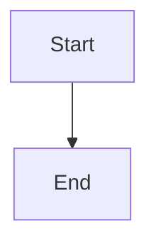
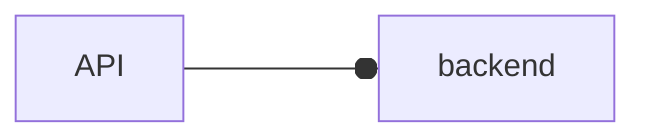

# Smoke: mermaid

Mermaid diagram validation — syntax errors, style warnings, flags.

## Setup

```bash
. tests/smoke/scripts/setup.sh
```

## Clean valid diagram

```bash
cat > "$SCRATCH/design.md" << 'EOF'
# Design



Some text.
EOF

uv run meridian mermaid check "$SCRATCH"
```
- [ ] Exit 0
- [ ] No `warning` in output

## No diagrams

```bash
echo "# Plain\n\nNo diagrams." > "$SCRATCH/plain.md"
uv run meridian mermaid check "$SCRATCH"
```
- [ ] Exit 0

## Broken syntax — no traceback

```bash
cat > "$SCRATCH/broken.md" << 'EOF'
# Broken

```mermaid
graph TD
    A[Start --> B[End
```
EOF

uv run meridian mermaid check "$SCRATCH"
```
- [ ] No `Traceback` in stderr (may exit 0 or 1 depending on parser strictness)

## Standalone .mmd file

```bash
printf 'graph LR\n    X --> Y --> Z\n' > "$SCRATCH/diagram.mmd"
uv run meridian mermaid check "$SCRATCH/diagram.mmd"
```
- [ ] Exit 0

## cwd default

```bash
echo "# Test" > "$SCRATCH/any.md"
cd "$SCRATCH" && uv run meridian mermaid check
```
- [ ] Exit 0

## Style warnings emitted but exit 0

```bash
cat > "$SCRATCH/warn.md" << 'EOF'
# Test


EOF

uv run meridian mermaid check "$SCRATCH"
```
- [ ] Exit 0
- [ ] stdout contains `warning[ox-edge]`

## --strict makes style warnings cause exit 1

```bash
uv run meridian mermaid check "$SCRATCH" --strict
```
- [ ] Exit 1

## --no-style suppresses all style warnings

```bash
uv run meridian mermaid check "$SCRATCH" --no-style
```
- [ ] Exit 0
- [ ] `warning` does NOT appear in stdout

## --disable suppresses only that category

```bash
uv run meridian mermaid check "$SCRATCH" --disable ox-edge
```
- [ ] Exit 0
- [ ] `warning[ox-edge]` does NOT appear in stdout

## --format json includes warnings array

```bash
uv run meridian mermaid check "$SCRATCH" --format json
```
- [ ] Exit 0
- [ ] Valid JSON with `"warnings"` key
- [ ] JSON has `"total_warnings"` key

## Both syntax errors and style warnings reported

```bash
cat > "$SCRATCH/mixed.md" << 'EOF'
# Mixed


```mermaid
foobar
    broken syntax
```
EOF

uv run meridian mermaid check "$SCRATCH"
```
- [ ] Exit 1
- [ ] stdout contains `warning[ox-edge]`
- [ ] stderr contains `invalid block(s) found`
